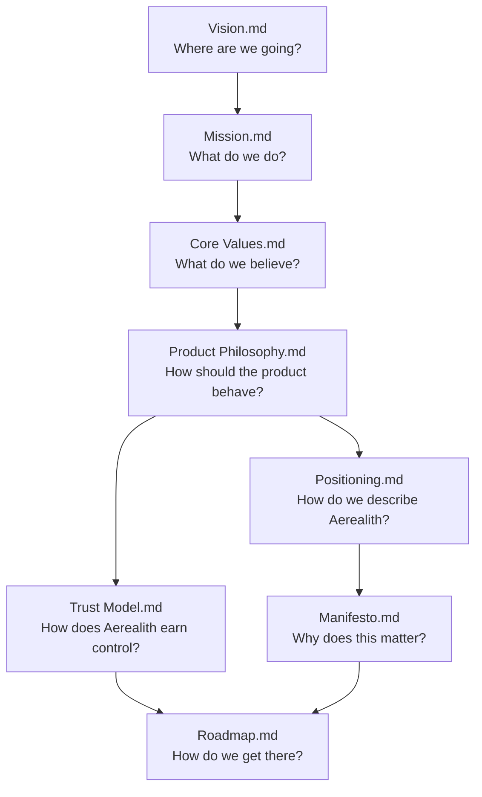
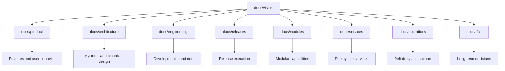

# Vision Documentation

The `docs/vision/` folder defines the long-term direction, beliefs, philosophy, positioning, trust model, and roadmap for Aerealith AI.

These documents explain **why Aerealith exists**, **what it stands for**, and **how it should grow** before implementation details, product specifications, architecture, or release planning are considered.

Aerealith AI is the operating system for your digital life.

**Tagline:** One Platform. Infinite Possibilities.

**North Star:** Reduce digital complexity without reducing user control.

---

## Purpose

The vision folder is the foundation for every other documentation area in the project.

These documents should guide:

- product decisions
- architecture decisions
- feature planning
- release planning
- contributor expectations
- public messaging
- user trust
- long-term platform direction

If a future decision conflicts with the vision documents, that decision should be reconsidered or the vision should be intentionally revised.

The vision should evolve carefully, not casually.

---

## Reading Order

Read the documents in this order:

1. [Vision](./Vision.md)
2. [Mission](./Mission.md)
3. [Core Values](./Core%20Values.md)
4. [Product Philosophy](./Product%20Philosophy.md)
5. [Trust Model](./Trust%20Model.md)
6. [Positioning](./Positioning.md)
7. [Manifesto](./Manifesto.md)
8. [Roadmap](./Roadmap.md)

This order moves from broad purpose to practical direction.

---

## Document Map

---

## Documents

### [Vision.md](./Vision.md)

Defines the long-term future Aerealith is working toward.

This document answers:

- What is Aerealith AI?
- Why does it exist?
- What problem does it solve?
- What should it become?
- What does success look like?

Start here before reading any other vision document.

---

### [Mission.md](./Mission.md)

Defines what Aerealith exists to accomplish every day.

This document answers:

- What does Aerealith do?
- Who does it serve?
- How does it help users?
- What responsibilities does the platform have?
- How should users feel after using it?

The mission turns the long-term vision into daily purpose.

---

### [Core Values.md](./Core%20Values.md)

Defines what Aerealith believes.

This document answers:

- What principles should never be compromised?
- What does Aerealith believe about trust?
- What does Aerealith believe about user control?
- What does Aerealith believe about security, ownership, simplicity, and responsibility?

Core values are the foundation for product, engineering, and business decisions.

---

### [Product Philosophy.md](./Product%20Philosophy.md)

Defines how Aerealith products should be designed and experienced.

This document answers:

- How should Aerealith behave?
- How should AI assist users?
- How should automation work?
- How should integrations be approached?
- How should the platform grow without becoming overwhelming?

Product Philosophy turns values into product behavior.

---

### [Trust Model.md](./Trust%20Model.md)

Defines how Aerealith earns trust before receiving control.

This document answers:

- When should Aerealith ask permission?
- When should it verify intent?
- When can automation be offered?
- How should actions be explained?
- How should permissions be revoked?
- How should actions be audited?

The Trust Model is especially important for AI, automation, workflows, Discord operations, security-sensitive actions, and infrastructure control.

---

### [Positioning.md](./Positioning.md)

Defines how Aerealith should be described and understood.

This document answers:

- What category does Aerealith belong to?
- What is Aerealith not?
- How should users, communities, developers, and organizations understand it?
- What makes it different?
- How should public messaging sound?

Positioning keeps the product message clear and consistent.

---

### [Manifesto.md](./Manifesto.md)

Defines why Aerealith matters.

This document answers:

- What does Aerealith stand for?
- What future is it trying to build?
- What does it reject?
- Why should people trust it?
- Why should people want to build with it?

The Manifesto is the emotional and public-facing declaration of the project.

---

### [Roadmap.md](./Roadmap.md)

Defines the strategic path from foundation to launch and beyond.

This document answers:

- What major milestones will Aerealith follow?
- What comes before private beta?
- What comes before public launch?
- How does Discord fit into the larger platform?
- When do billing, AI, workflows, marketplace, companion apps, integrations, and self-hosting appear?

The roadmap is milestone-driven, not date-driven.

---

## Core Ideas

The vision folder is built around these ideas:

- Aerealith is the operating system for your digital life.
- Application sprawl has made the digital world too fragmented.
- Aerealith should reduce complexity without reducing user control.
- Trust is earned, never assumed.
- AI should explain itself.
- Automation should be permissioned, auditable, and revocable.
- Users own their data.
- Communities own their data.
- Integrate before replacing.
- Cohesion over fragmentation.
- Enhance people, never replace them.
- Every major capability should eventually be accessible through APIs.
- Every major dependency should be replaceable where practical.
- The platform should grow naturally without chasing hype.

---

## Relationship to Other Documentation

The vision folder should guide the rest of the documentation tree.

---

## How to Use These Documents

When designing a feature, ask:

- Does this align with the Vision?
- Does this support the Mission?
- Does this protect the Core Values?
- Does this follow the Product Philosophy?
- Does this satisfy the Trust Model?
- Does this match the Positioning?
- Does this support the Roadmap?

When the answer is unclear, pause and clarify the decision before implementation.

---

## Change Policy

Vision documents should be updated intentionally.

Small wording improvements are fine.

Major changes should be treated as strategic decisions because they may affect product behavior, architecture, release planning, public messaging, and user trust.

A major change should usually include:

- the reason for the change
- what documents are affected
- what product or architecture decisions may need review
- whether an RFC is required

---

## Final Standard

Aerealith should grow without losing itself.

The vision folder exists to make sure that every feature, release, service, module, integration, and automation continues to serve the same goal:

**One trusted platform that brings the digital world together while keeping users in control.**
