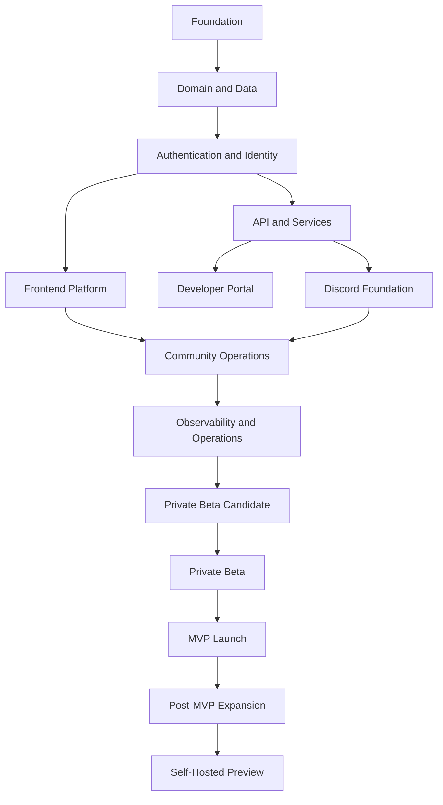

# Roadmap

Status: Active
Owner: SinLess Games LLC
Last Updated: 2026-07-17
Document Type: Product and Delivery Strategy
Planning Horizon: 20 Weeks
Primary Target: Aerealith Private Beta Candidate
Current Epic: Release 0.1

## Purpose

This document defines the planned development path for Aerealith.

It combines:

- The long-term release roadmap
- Release dependencies
- Milestone and exit criteria
- A detailed 20-week production plan
- Documentation requirements
- Security and quality gates
- Private-beta readiness requirements

Aerealith should be developed through milestone-based releases.

The 20-week schedule provides sequencing, focus, and accountability, but it does
not override release quality.

A release should move forward only when its foundations, dependencies, testing,
documentation, security controls, and exit criteria are strong enough to support
the next stage.

The goal is not to rush toward launch.

The goal is to build a trustworthy platform that can grow for years without
losing its foundation.

---

## Canonical Product Distinction

### Aerealith

**Aerealith** is the platform.

It provides the shared foundation for identity, permissions, integrations,
workflows, automation, community operations, data, observability, and extensible
modules.

### Aerealith AI

**Aerealith AI** is the intelligent assistant inside the Aerealith platform.

It helps users understand connected systems, review recommendations, coordinate
workflows, and execute approved actions within explicit trust boundaries.

> **Aerealith is the platform.**
>
> **Aerealith AI is the assistant within the platform.**

The first 20 weeks primarily build the platform foundation required for later
Aerealith AI capabilities.

---

## North Star

> **Reduce digital complexity without reducing user control.**

Every release, epic, feature, integration, and automation should move Aerealith
closer to this goal.

---

# Roadmap Philosophy

Aerealith follows six delivery principles.

## 1. Milestones Over Dates

Dates provide planning structure.

Exit criteria determine completion.

A release should not ship merely because its target week has arrived.

---

## 2. Foundation Before Expansion

Aerealith should not expand into advanced AI, marketplace, mobile, or broad
integration work before its core platform can support those capabilities
securely.

---

## 3. Vertical Progress Over Isolated Components

Each development phase should produce usable end-to-end progress.

Frontend, backend, data, authentication, security, observability, testing, and
documentation should evolve together.

---

## 4. Documentation Is Part of Delivery

A feature is incomplete when its behavior, operation, configuration, security
requirements, or limitations are undocumented.

Documentation work should happen during implementation rather than being delayed
until the end of a release.

---

## 5. Security and Trust Are Release Gates

Security, permissions, auditability, validation, and safe failure behavior are
not optional post-launch improvements.

They are release requirements.

---

## 6. Discord First, Not Discord Only

Discord is the first flagship integration and community surface.

It should prove that Aerealith can support:

- Multi-tenant environments
- Permissions
- Modular configuration
- Automation
- Auditable actions
- Community workflows
- Operational visibility
- Future AI assistance

Discord must strengthen the broader platform rather than become an isolated bot
product.

---

# Strategic Direction

Aerealith is larger than any single product surface.

The web application and Discord platform are the first major user-facing
experiences, but they are not the whole platform.

Aerealith should eventually support:

- Web application
- Discord platform
- Developer APIs
- Automation workflows
- Aerealith AI
- User-controlled memory
- Marketplace modules
- Mobile and desktop companions
- Advanced integrations
- Hosted deployment
- Hybrid deployment
- Self-hosted deployment
- Offline-capable functions where practical

The first 20 weeks focus on building the path from engineering foundation to a
private-beta candidate.

---

# Twenty-Week Objective

The primary objective of the initial 20-week production period is:

> Deliver a secure, documented, observable, and testable Aerealith private-beta
> candidate supporting accounts, the web platform, Discord installation,
> community linking, modular configuration, basic moderation, basic tickets,
> and auditable operational workflows.

The 20-week target includes releases:

- `0.1` — Foundation and Workspace
- `0.2` — Core Domain and Data Platform
- `0.3` — Authentication and Identity
- `0.4` — Frontend Platform
- `0.5` — API and Service Platform
- `0.6` — Developer Portal and Integration Foundation
- `0.7` — Discord Platform Foundation
- `0.8` — Moderation, Tickets, and Community Operations
- `0.9` — Observability, Reliability, and Operations
- `1.0-beta.1` — Private Beta Candidate

The schedule does not require every long-term roadmap release to be completed
within 20 weeks.

---

# Planning Assumptions

The 20-week plan assumes:

- A small active development team
- The Nx monorepo remains the source of truth
- pnpm is the package manager
- TypeScript is the primary application language
- Vite, React Router, Tailwind CSS, and TanStack tools power the frontend
- Hono is used for service and API foundations
- PostgreSQL or CockroachDB is used for persistence
- Drizzle is the ORM and migration layer
- Discord is the first flagship integration
- Every deployable service receives a Dockerfile
- GitHub Actions provides CI foundations
- Datadog and related tools may provide operational telemetry
- Snyk, Semgrep, Codecov, Dependabot, Renovate, and related tools support quality
  and security
- Documentation is developed alongside implementation
- Release scope may be reduced before quality gates are weakened

Team size affects throughput, not release standards.

---

# Release Flow

```mermaid
flowchart TD
    R01["0.1 — Foundation & Workspace"]
    R02["0.2 — Core Domain & Data Platform"]
    R03["0.3 — Authentication & Identity"]
    R04["0.4 — Frontend Platform"]
    R05["0.5 — API & Service Platform"]
    R06["0.6 — Developer Portal & Integrations"]
    R07["0.7 — Discord Platform Foundation"]
    R08["0.8 — Moderation, Tickets & Community Operations"]
    R09["0.9 — Observability, Reliability & Operations"]
    R10["1.0-beta.1 — Private Beta Candidate"]
    R11["1.0 — Private Beta"]
    R12["1.1 — MVP Production Launch"]
    R13["1.2 — Billing, Entitlements & Plans"]
    R14["1.3 — AI Assistant & Memory Foundation"]
    R15["1.4 — Workflow Automation Builder"]
    R16["1.5 — Marketplace & Module Ecosystem"]
    R17["1.6 — Mobile/Desktop Companion"]
    R18["1.7 — Digital Life OS Expansion"]
    R19["1.8 — Advanced Integrations"]
    R20["1.9 — Cloud Independence"]
    R21["2.0 — Self-Hosted Preview"]

    R01 --> R02 --> R03 --> R04 --> R05
    R05 --> R06 --> R07 --> R08 --> R09
    R09 --> R10 --> R11 --> R12
    R12 --> R13 --> R14 --> R15 --> R16
    R16 --> R17 --> R18 --> R19 --> R20 --> R21
```

---

# Twenty-Week Summary

| Week | Primary Focus                                             | Target Release |
| ---: | --------------------------------------------------------- | -------------- |
|    1 | Repository baseline and workspace stabilization           | 0.1            |
|    2 | Shared tooling, CI, Docker, and contributor workflow      | 0.1            |
|    3 | Domain language, contracts, validation, and error model   | 0.2            |
|    4 | Database, Drizzle, repositories, and migrations           | 0.2            |
|    5 | Authentication architecture and account lifecycle         | 0.3            |
|    6 | Sessions, authorization, consent, and identity hardening  | 0.3            |
|    7 | Design system and public frontend shell                   | 0.4            |
|    8 | Authenticated app shell, settings, and accessibility      | 0.4            |
|    9 | Service templates, HTTP standards, and API contracts      | 0.5            |
|   10 | Auth/User services and end-to-end API integration         | 0.5            |
|   11 | Developer portal, API documentation, keys, and webhooks   | 0.6            |
|   12 | Discord application, installation, and guild linking      | 0.7            |
|   13 | Discord commands, events, permissions, and modules        | 0.7            |
|   14 | Moderation foundation and audit workflows                 | 0.8            |
|   15 | Ticket system, transcripts, and staff workflows           | 0.8            |
|   16 | Onboarding, roles, verification, and community UI         | 0.8            |
|   17 | Logging, metrics, tracing, dashboards, and alerts         | 0.9            |
|   18 | Reliability, backup, recovery, security, and load testing | 0.9            |
|   19 | Private-beta preparation, documentation, and onboarding   | 1.0-beta.1     |
|   20 | Release candidate validation and beta launch decision     | 1.0-beta.1     |

---

# Week-by-Week Production Plan

## Week 1 — Repository Baseline and Workspace Stabilization

**Release:** `0.1`
**Theme:** Establish the source of truth
**Primary Outcome:** The repository has a verified, documented, repeatable
baseline.

### Development

- Audit the current Nx workspace
- Confirm all applications and libraries are represented in the workspace
- Remove or document abandoned scaffolding
- Confirm the root package manager and package-manager version
- Confirm Node.js version requirements
- Validate `pnpm-workspace.yaml`
- Validate `nx.json`
- Validate root TypeScript configuration
- Standardize package naming
- Define workspace directory conventions
- Define application and library ownership boundaries
- Identify circular dependencies
- Establish dependency constraints
- Confirm repository build commands
- Confirm development commands
- Confirm test commands
- Confirm lint and type-check commands

### Documentation

- Update root `README.md`
- Update `CONTRIBUTING.md`
- Document repository layout
- Document required development software
- Document installation steps
- Document common commands
- Document package naming rules
- Document application and library boundaries
- Create or update the local-development guide
- Confirm `docs/README.md` is the documentation entry point
- Correct broken internal documentation links

### Security and Quality

- Audit committed environment files
- Confirm secrets are excluded from Git
- Add or verify secret-scanning configuration
- Verify lockfile integrity
- Review package scripts for unsafe behavior
- Establish protected-branch expectations
- Define the baseline pull-request checklist

### Deliverables

- Reproducible local installation
- Verified workspace graph
- Documented repository structure
- Working root validation commands
- Initial dependency-boundary rules
- Updated contributor documentation

### Exit Criteria

- A clean clone can install successfully
- The workspace graph renders without unexplained failures
- Root lint, type-check, test, and build commands are documented
- No known secrets are committed
- Broken repository references are identified and assigned
- Release `0.1` remaining work is clearly scoped

---

## Week 2 — Shared Tooling, CI, Docker, and Contributor Workflow

**Release:** `0.1`
**Theme:** Enforce the engineering baseline
**Primary Outcome:** The development foundation is automatically validated.

### Development

- Standardize ESLint configuration
- Standardize Prettier configuration
- Configure Commitlint
- Configure staged-file validation
- Define TypeScript strictness requirements
- Add shared testing configuration
- Create shared environment-loading conventions
- Create application health-check conventions
- Add Dockerfiles to existing deployable services
- Define base Docker image strategy
- Define local container-development workflow
- Add or validate `.editorconfig`
- Standardize package scripts
- Configure Nx affected commands

### Continuous Integration

- Add pull-request validation workflow
- Add lint validation
- Add type-check validation
- Add unit-test validation
- Add build validation
- Add dependency review
- Add Codecov reporting
- Add Semgrep scanning
- Add Snyk scanning where supported
- Add secret scanning
- Confirm Dependabot configuration
- Confirm Renovate configuration
- Add workflow failure guidance
- Publish CI status expectations

### Documentation

- Document CI jobs
- Document local equivalents of CI commands
- Document Docker build expectations
- Document dependency update policy
- Document formatting and lint rules
- Document commit-message expectations
- Document branch and pull-request workflow
- Document release `0.1` verification procedure

### Deliverables

- Enforced quality pipeline
- Docker baseline
- Shared tooling configuration
- Contributor workflow
- Security and dependency scanning baseline

### Exit Criteria

- Pull requests automatically lint, type-check, test, and build affected code
- Security scanners execute or have documented implementation blockers
- Every active deployable service has a Docker strategy
- Contributor setup is reproducible
- Workspace rules are enforced rather than merely documented
- Release `0.1` exit review is completed

---

## Week 3 — Domain Language, Contracts, Validation, and Errors

**Release:** `0.2`
**Theme:** Define shared platform language
**Primary Outcome:** Core platform entities and contracts have stable initial
definitions.

### Development

- Define the initial tenant model
- Define user and account concepts
- Define profile and preference concepts
- Define session concepts
- Define consent records
- Define integration connections
- Define community and guild concepts
- Define module configuration concepts
- Define audit-event concepts
- Define workflow concepts
- Define service error categories
- Create shared enums
- Create Zod validation schemas
- Create API request and response contracts
- Define identifier conventions
- Define timestamps and timezone conventions
- Define pagination contracts
- Define filtering and sorting contracts
- Define serialization conventions
- Define public versus internal data shapes

### Architecture

- Document domain boundaries
- Document tenant ownership
- Document service ownership of data
- Define rules for shared contracts
- Define rules for avoiding cross-service database coupling
- Record material decisions through ADRs or DECs
- Map domain entities to future services

### Documentation

- Create domain glossary
- Document naming conventions
- Document validation strategy
- Document error-response standard
- Document contract versioning expectations
- Document current limitations
- Mark speculative entities as future rather than current

### Testing

- Add schema tests
- Add serialization tests
- Add invalid-input tests
- Add error-contract tests
- Add contract compatibility fixtures

### Deliverables

- Initial shared domain library
- Shared validation library
- Shared contract library
- Stable error model
- Domain glossary
- Domain ownership documentation

### Exit Criteria

- Core entities have reviewed definitions
- Public contracts do not expose internal persistence details
- Validation is reusable by frontend and backend packages
- Error responses follow one documented structure
- Tenant boundaries are represented in domain concepts
- No unresolved critical terminology conflicts remain

---

## Week 4 — Database, Drizzle, Repositories, and Migrations

**Release:** `0.2`
**Theme:** Establish persistence safely
**Primary Outcome:** Aerealith has a reproducible and testable database
foundation.

### Development

- Configure PostgreSQL or CockroachDB environments
- Configure Drizzle
- Establish schema folder conventions
- Establish migration naming conventions
- Implement initial user schema
- Implement account schema
- Implement profile schema
- Implement preferences schema
- Implement consent schema
- Implement session schema
- Implement tenant schema
- Implement membership schema
- Implement waitlist schema
- Implement initial audit-event schema
- Add repository abstractions
- Add transaction conventions
- Add database error translation
- Add seed-data support
- Add test-database setup
- Add migration execution commands
- Add migration status checks
- Add rollback guidance where technically supported

### Security

- Separate application and migration credentials
- Document least-privilege database roles
- Prevent sensitive fields from being logged
- Define credential rotation expectations
- Review tenant-scoping requirements
- Add initial data-classification notes

### Testing

- Test clean database creation
- Test migration from previous schema state
- Test seed operations
- Test repository behavior
- Test unique constraints
- Test tenant-scoped queries
- Test transactional failure behavior
- Test database startup in local containers

### Documentation

- Database setup guide
- Migration guide
- Schema ownership guide
- Repository-pattern guide
- Local database troubleshooting
- Backup and recovery assumptions
- Environment-specific migration process

### Deliverables

- Drizzle configuration
- Initial production schemas
- Repository foundation
- Repeatable migrations
- Database development environment
- Persistence documentation

### Exit Criteria

- A clean database can be created from migrations
- Application repositories pass integration tests
- Tenant-scoped access patterns are defined
- Sensitive fields are protected from normal logs
- Preview, staging, and production migration paths are documented
- Release `0.2` exit review is completed

---

## Week 5 — Authentication Architecture and Account Lifecycle

**Release:** `0.3`
**Theme:** Secure account entry
**Primary Outcome:** Users can begin creating and verifying accounts safely.

### Development

- Finalize authentication architecture
- Implement sign-up
- Implement login
- Implement logout
- Implement email verification
- Integrate Resend for verification delivery
- Implement verification token lifecycle
- Implement account lookup
- Implement duplicate-account handling
- Implement password policy if password authentication is used
- Implement password hashing
- Implement authentication error responses
- Implement rate limiting
- Implement anti-enumeration behavior
- Implement account status handling
- Implement basic recovery flow
- Add authentication events to audit logging
- Add authentication configuration validation

### Security

- Threat-model account creation and login
- Review token generation
- Review token storage
- Review token expiration
- Add brute-force protection
- Prevent account enumeration
- Add secure cookie settings where applicable
- Validate redirect destinations
- Define compromised-account response
- Define session invalidation requirements

### Frontend

- Create sign-up screen
- Create login screen
- Create verification screen
- Create verification resend flow
- Create authentication error states
- Add loading and retry states
- Add accessibility validation
- Add privacy and consent links

### Documentation

- Authentication overview
- Sign-up sequence
- Verification sequence
- Recovery sequence
- Security assumptions
- Authentication environment configuration
- Troubleshooting guide

### Deliverables

- Working account creation
- Working verification delivery
- Working login and logout
- Initial authentication UI
- Authentication audit events
- Authentication threat model

### Exit Criteria

- A user can create and verify an account
- Login failures do not expose account existence unnecessarily
- Authentication events are auditable
- Token expiration and revocation behavior are tested
- Primary authentication flows pass integration tests

---

## Week 6 — Sessions, Authorization, Consent, and Identity Hardening

**Release:** `0.3`
**Theme:** Enforce identity beyond login
**Primary Outcome:** Protected resources consistently evaluate identity,
permissions, and consent.

### Development

- Implement session creation
- Implement session rotation
- Implement token refresh
- Implement session revocation
- Implement global logout
- Implement active-session listing
- Implement role foundations
- Implement permission foundations
- Implement tenant membership
- Implement authorization middleware
- Implement consent capture
- Implement consent versioning
- Implement account lifecycle states
- Implement account disable flow
- Implement account deletion-request foundation
- Add authorization decision logging
- Add stale-authentication detection
- Add reauthentication hooks for high-risk actions

### Security

- Review session fixation risks
- Review cross-site request protections
- Review cross-origin policy
- Review cookie and token storage
- Test role and tenant isolation
- Test authorization failures
- Test revoked-session behavior
- Test expired-session behavior
- Add security headers
- Define privileged-action confirmation requirements

### Frontend

- Add session-expired handling
- Add active-session management
- Add account security settings
- Add consent display
- Add consent history foundation
- Add logout-all-sessions control
- Add account lifecycle messaging

### Documentation

- Session lifecycle
- Authorization model
- Role model
- Consent model
- Tenant membership model
- Privileged-action guidance
- Identity incident-response notes

### Deliverables

- Secure session lifecycle
- Authorization middleware
- Role and permission baseline
- Consent records
- Account security settings
- Identity security test suite

### Exit Criteria

- Protected endpoints consistently enforce authorization
- Sessions can be listed and revoked
- Cross-tenant access tests pass
- Consent records are attributable and versioned
- High-risk actions can require stronger authentication
- Release `0.3` security review is completed

---

## Week 7 — Design System and Public Frontend Shell

**Release:** `0.4`
**Theme:** Establish a coherent visual platform
**Primary Outcome:** Aerealith has a reusable frontend foundation and public
shell.

### Development

- Configure Vite application structure
- Configure React Router
- Configure Tailwind CSS
- Configure TanStack Query or equivalent selected tooling
- Establish frontend state conventions
- Create shared UI package
- Define design tokens
- Define typography
- Define spacing
- Define component states
- Define responsive breakpoints
- Create theme foundation
- Create light and dark behavior if in scope
- Build public navigation
- Build public footer
- Build website shell
- Build documentation shell foundation
- Build developer portal shell foundation
- Add error boundary
- Add loading-state standards
- Add empty-state standards
- Add frontend configuration validation

### Accessibility

- Establish keyboard-navigation requirements
- Establish focus-state requirements
- Establish contrast requirements
- Establish reduced-motion support
- Establish semantic-heading rules
- Add automated accessibility checks
- Test shared components with keyboard navigation

### Documentation

- Design-system overview
- Component-contribution rules
- Accessibility checklist
- Frontend architecture
- Routing conventions
- State-management guidance
- Error and loading-state guidance

### Deliverables

- Shared UI library
- Public site shell
- Documentation shell
- Developer portal shell
- Design tokens
- Accessibility baseline

### Exit Criteria

- Shared components are reusable across frontend surfaces
- Public pages work across supported screen sizes
- Baseline accessibility tests pass
- Error and loading states are consistent
- Frontend conventions are documented

---

## Week 8 — Authenticated App Shell, Settings, and Accessibility

**Release:** `0.4`
**Theme:** Deliver the first coherent user workspace
**Primary Outcome:** Authenticated users can navigate a functional application
shell and manage core account settings.

### Development

- Build authenticated application layout
- Build primary navigation
- Build dashboard shell
- Build user-profile screen
- Build account settings
- Build security settings
- Build session-management screen
- Build preference settings
- Build consent settings
- Build connected-services placeholder
- Build community placeholder
- Build module-management placeholder
- Add route guards
- Add permission-aware navigation
- Add API-client foundation
- Add global error handling
- Add notification and toast conventions
- Add optimistic-update rules
- Add form validation
- Add responsive navigation

### Observability

- Add frontend error reporting
- Add page-view telemetry with privacy controls
- Add route-performance measurements
- Add correlation identifiers for API failures
- Ensure sensitive form data is excluded from telemetry

### Testing

- Add component tests
- Add route tests
- Add form-validation tests
- Add authentication-flow end-to-end tests
- Add profile-update end-to-end test
- Add session-revocation end-to-end test
- Add accessibility scans

### Documentation

- User settings guide
- Frontend observability guide
- Route-guard behavior
- Form standards
- Accessibility exceptions and remediation process

### Deliverables

- Authenticated app shell
- Account and profile settings
- Security controls
- Permission-aware navigation
- Frontend end-to-end baseline

### Exit Criteria

- Core account workflows function end to end
- Protected routes reject unauthenticated users
- Session revocation is usable from the frontend
- Accessibility blockers are resolved or documented
- Frontend telemetry excludes protected data
- Release `0.4` exit review is completed

---

## Week 9 — Service Templates, HTTP Standards, and API Contracts

**Release:** `0.5`
**Theme:** Standardize backend service development
**Primary Outcome:** New services can be created and operated consistently.

### Development

- Finalize Hono service conventions
- Create service generator or template
- Define service directory structure
- Define dependency injection conventions
- Define configuration schema
- Define health endpoint
- Define readiness endpoint
- Define version endpoint
- Define HTTP request identifiers
- Define correlation identifiers
- Define standard error responses
- Define pagination behavior
- Define rate-limit responses
- Define authentication middleware
- Define authorization middleware
- Define validation middleware
- Define structured logging middleware
- Define service startup and shutdown behavior
- Define graceful termination
- Establish `/v1/services` routing convention
- Define tRPC boundaries where useful
- Define GraphQL boundaries where justified
- Define WebSocket conventions where justified

### Docker and Operations

- Create shared container patterns
- Add non-root execution
- Add container health checks
- Add graceful shutdown
- Add environment validation at startup
- Add development container support
- Define container tagging conventions

### Documentation

- Service-development guide
- API style guide
- Error catalog
- Configuration guide
- Health and readiness guide
- Service security checklist
- Versioning policy

### Testing

- Service-template tests
- Middleware tests
- Error-response tests
- Health-check tests
- Graceful-shutdown tests
- Container startup tests

### Deliverables

- Service template
- Shared backend middleware
- API standards
- Container baseline
- Service-development documentation

### Exit Criteria

- A new service can be generated from the template
- Generated services pass lint, test, type-check, and build
- Services expose consistent health and error behavior
- Containers run as non-root where practical
- API versioning rules are documented

---

## Week 10 — Auth/User Services and End-to-End API Integration

**Release:** `0.5`
**Theme:** Prove the service platform
**Primary Outcome:** Core identity and user capabilities operate through
deployable services and the web application.

### Development

- Extract or formalize Auth service
- Extract or formalize User service
- Implement service-to-service authentication foundation
- Implement user-profile APIs
- Implement preference APIs
- Implement session APIs
- Implement consent APIs
- Implement account-status APIs
- Add API request validation
- Add response serialization
- Add service-level authorization
- Add database repository integration
- Add distributed request correlation
- Add API documentation generation
- Connect frontend API client
- Implement retry rules
- Implement timeout rules
- Implement standardized client error handling

### Testing

- Auth service unit tests
- User service unit tests
- Repository integration tests
- API integration tests
- Frontend-to-service end-to-end tests
- Authorization boundary tests
- Tenant-isolation tests
- Container integration tests
- Failure and timeout tests

### Documentation

- Auth service reference
- User service reference
- API examples
- Environment configuration
- Local multi-service development
- Troubleshooting distributed requests
- Known limitations

### Deliverables

- Deployable Auth service
- Deployable User service
- Connected frontend
- Generated API documentation
- End-to-end service tests

### Exit Criteria

- Core user workflows operate through service APIs
- Services are independently deployable and testable
- Authorization remains consistent across service boundaries
- API documentation matches implemented contracts
- Failure behavior is visible and understandable
- Release `0.5` exit review is completed

---

## Week 11 — Developer Portal, API Documentation, Keys, and Webhooks

**Release:** `0.6`
**Theme:** Establish the developer experience
**Primary Outcome:** Developers can understand and begin integrating with the
platform.

### Development

- Build developer portal navigation
- Publish API overview
- Publish authentication guide
- Publish authorization guide
- Publish error guide
- Publish pagination guide
- Publish rate-limit guide
- Add interactive or generated API reference
- Design API-key model
- Implement API-key creation foundation
- Implement API-key naming
- Implement API-key hashing
- Implement key-prefix identification
- Implement key revocation
- Implement key last-used tracking
- Design webhook model
- Implement webhook registration foundation
- Implement webhook-secret generation
- Implement signed webhook delivery
- Implement retry strategy
- Implement webhook delivery logs
- Implement webhook disable behavior
- Add developer diagnostics foundation

### Security

- Prevent raw API keys from being stored
- Display secrets only at creation
- Add key-scope foundation
- Add key expiration
- Add webhook signature verification guidance
- Add rate limiting
- Add abuse-monitoring expectations
- Add secret-rotation procedure

### Documentation

- Quick-start guide
- API-key guide
- Webhook guide
- Signature-verification examples
- Integration troubleshooting
- SDK and client-generation strategy
- Developer support expectations
- API deprecation policy

### Deliverables

- Developer portal baseline
- API reference
- API-key foundation
- Webhook foundation
- Developer quick start
- Integration diagnostics baseline

### Exit Criteria

- A developer can discover and understand available APIs
- API keys can be created, scoped, and revoked
- Webhook deliveries are signed and auditable
- Documentation matches the current implementation
- Developer-facing limitations are explicit
- Release `0.6` exit review is completed

---

## Week 12 — Discord Application, Installation, and Guild Linking

**Release:** `0.7`
**Theme:** Establish Discord as the first flagship integration
**Primary Outcome:** A Discord community can install and link Aerealith safely.

### Development

- Confirm official Discord application configuration
- Establish bot package and service architecture
- Implement Discord authentication flow
- Implement installation flow
- Implement OAuth callback handling
- Implement guild discovery
- Implement guild linking
- Implement guild unlinking
- Implement guild ownership verification
- Implement tenant and guild relationship
- Implement bot token handling
- Implement installation-state tracking
- Implement Discord permission discovery
- Implement required-permission validation
- Implement connection-health status
- Implement Discord integration settings
- Add reconnect and reauthorization flow
- Add guild-link audit events
- Add installation error handling

### Frontend

- Build Discord connection screen
- Build guild-selection screen
- Build installation-status screen
- Build missing-permission warnings
- Build reconnect flow
- Build guild overview shell
- Display acting tenant and guild clearly

### Security

- Protect Discord credentials
- Validate OAuth state
- Validate callback targets
- Prevent unauthorized guild linking
- Enforce tenant boundaries
- Review bot permission requirements
- Avoid requesting unnecessary Discord permissions
- Log installation and authorization changes

### Documentation

- Discord installation guide
- Required permissions
- Guild-linking guide
- Reauthorization guide
- Troubleshooting guide
- Data-access explanation
- Privacy and retention notes

### Deliverables

- Official application integration
- Guild installation flow
- Guild linking
- Permission validation
- Discord connection dashboard

### Exit Criteria

- An authorized Discord administrator can install Aerealith
- A guild can be linked to the correct Aerealith tenant
- Unauthorized users cannot claim a guild
- Missing permissions are explained
- Installation and linking actions are audited

---

## Week 13 — Discord Commands, Events, Permissions, and Modules

**Release:** `0.7`
**Theme:** Build the modular Discord runtime
**Primary Outcome:** Discord interactions are reliable, authorized, observable,
and configurable.

### Development

- Implement Discord event ingestion
- Implement slash-command registration
- Implement interaction router
- Implement command authorization
- Implement role mapping
- Implement channel mapping
- Implement guild configuration
- Implement module registry
- Implement module enable flow
- Implement module disable flow
- Implement module configuration schema
- Implement module permission manifest
- Implement command availability by module
- Implement Discord event deduplication
- Implement rate-limit handling
- Implement retry and dead-letter behavior
- Implement Discord audit conventions
- Implement interaction response standards
- Add baseline status command
- Add baseline help command
- Add baseline configuration command

### Testing

- Event-handler tests
- Command authorization tests
- Role-mapping tests
- Channel-mapping tests
- Module lifecycle tests
- Guild-isolation tests
- Rate-limit tests
- Duplicate-event tests
- Interaction timeout tests

### Documentation

- Discord architecture
- Command-development guide
- Module-development guide
- Permission mapping
- Event-handling conventions
- Discord rate-limit strategy
- Guild configuration model
- Audit-event mapping

### Deliverables

- Discord runtime
- Slash-command system
- Event-processing system
- Module lifecycle
- Permission and role mapping
- Discord operational documentation

### Exit Criteria

- Commands are available only when authorized
- Modules can be enabled and disabled safely
- Guild data remains isolated
- Discord events are deduplicated
- Rate-limit and failure behavior are documented
- Release `0.7` exit review is completed

---

## Week 14 — Moderation Foundation and Audit Workflows

**Release:** `0.8`
**Theme:** Deliver controlled community moderation
**Primary Outcome:** Authorized moderators can perform basic actions with clear
audit records.

### Development

- Define moderation case model
- Implement warning workflow
- Implement timeout workflow
- Implement kick workflow
- Implement ban workflow
- Implement unban workflow
- Implement reason requirements
- Implement evidence-reference foundation
- Implement moderation-history lookup
- Implement temporary-action expiration
- Implement moderator notes
- Implement role and permission checks
- Implement Discord hierarchy checks
- Implement action previews
- Implement high-risk confirmation
- Implement reversal behavior where supported
- Implement moderation audit events
- Implement moderation log output
- Add configurable moderation channels
- Add initial automod rule structure without unrestricted enforcement

### Trust and Safety

- Align moderation actions with Trust Model
- Require explicit confirmation for high-impact actions
- Ensure AI cannot independently impose serious punishment
- Define user appeal-data foundation
- Define evidence-retention rules
- Define moderator override records
- Prevent actions against protected or higher-ranked users

### Frontend

- Build moderation case list
- Build moderation case detail
- Build moderation settings
- Build log-channel settings
- Build moderation action review
- Build permission warnings

### Testing

- Authorization tests
- Hierarchy tests
- Temporary-action tests
- Audit-record tests
- Reversal tests
- Guild-isolation tests
- High-risk confirmation tests

### Documentation

- Moderator guide
- Moderation policy integration
- Action severity guidance
- Audit and evidence guidance
- Retention guidance
- Known limitations

### Deliverables

- Basic moderation suite
- Moderation cases
- Audit records
- Moderator dashboard
- Permission-aware controls

### Exit Criteria

- Authorized moderators can perform supported actions
- Every meaningful moderation action is auditable
- Discord hierarchy is enforced
- Temporary actions expire reliably
- High-impact actions require appropriate verification

---

## Week 15 — Ticket System, Transcripts, and Staff Workflows

**Release:** `0.8`
**Theme:** Deliver community support operations
**Primary Outcome:** Communities can create, manage, close, and audit support
tickets.

### Development

- Define ticket domain model
- Define ticket category model
- Implement ticket creation
- Implement ticket channel creation
- Implement requester access
- Implement staff access
- Implement staff assignment
- Implement claim and unclaim flow
- Implement internal notes
- Implement escalation
- Implement ticket priority
- Implement ticket status
- Implement ticket close
- Implement ticket reopen where supported
- Implement transcript generation
- Implement transcript access controls
- Implement transcript storage abstraction
- Implement retention configuration
- Implement deletion-request behavior
- Implement ticket audit events
- Implement duplicate-ticket controls
- Implement ticket limits and rate limiting

### Frontend

- Build ticket configuration screen
- Build ticket category screen
- Build ticket list
- Build ticket detail
- Build staff-assignment controls
- Build transcript access screen
- Build retention settings
- Build escalation configuration

### Security and Privacy

- Protect private ticket content
- Prevent unauthorized transcript access
- Define retention defaults
- Define export behavior
- Define deletion constraints
- Avoid storing unnecessary message content
- Audit transcript access

### Testing

- Ticket lifecycle tests
- Access-control tests
- Transcript tests
- Retention tests
- Staff-assignment tests
- Rate-limit tests
- Guild-isolation tests
- Failure recovery tests

### Documentation

- Ticket administrator guide
- Staff workflow guide
- Transcript guide
- Retention guide
- Privacy considerations
- Recovery procedures

### Deliverables

- Ticket lifecycle
- Staff assignment
- Ticket transcripts
- Retention configuration
- Ticket audit trail
- Ticket management UI

### Exit Criteria

- Users can open supported tickets
- Authorized staff can claim and manage tickets
- Transcripts are access controlled
- Ticket actions are auditable
- Retention behavior is documented and configurable
- Partial ticket failures do not silently lose state

---

## Week 16 — Onboarding, Roles, Verification, and Community UI

**Release:** `0.8`
**Theme:** Complete the initial community-operations experience
**Primary Outcome:** Communities can configure basic onboarding, verification,
roles, moderation, and tickets through one platform.

### Development

- Implement welcome configuration
- Implement onboarding message
- Implement verification flow
- Implement starter-role assignment
- Implement configurable role automation
- Implement join and leave event handling
- Implement basic rules acknowledgement
- Implement onboarding audit events
- Implement community settings overview
- Implement module overview
- Implement module health indicators
- Implement community dashboard metrics
- Implement Discord synchronization status
- Implement configuration validation
- Implement change-preview foundation
- Implement safe configuration updates
- Add permission-drift warnings
- Add disconnected-integration warnings

### Frontend

- Build community dashboard
- Build module-management screen
- Build onboarding configuration
- Build verification configuration
- Build role automation settings
- Build Discord health panel
- Build configuration validation messages
- Build audit-history view foundation

### Testing

- Onboarding tests
- Verification tests
- Role-assignment tests
- Permission-drift tests
- Module-configuration tests
- Dashboard tests
- Multi-community tests
- End-to-end community setup test

### Documentation

- Community administrator guide
- Onboarding guide
- Verification guide
- Role automation guide
- Module management guide
- Community launch checklist

### Deliverables

- Community dashboard
- Onboarding
- Verification
- Basic role automation
- Module management
- End-to-end community configuration

### Exit Criteria

- A community can configure onboarding without direct developer assistance
- Module state is visible and controllable
- Role assignments respect Discord hierarchy
- Configuration problems are explained
- Core moderation and ticket workflows pass end-to-end tests
- Release `0.8` exit review is completed

---

## Week 17 — Logging, Metrics, Tracing, Dashboards, and Alerts

**Release:** `0.9`
**Theme:** Make the platform observable
**Primary Outcome:** Critical workflows can be measured and traced across
services.

### Development and Operations

- Standardize structured logging
- Add request correlation
- Add distributed tracing
- Add service metrics
- Add database metrics
- Add queue and event metrics
- Add Discord interaction metrics
- Add moderation workflow metrics
- Add ticket workflow metrics
- Add authentication metrics
- Add frontend telemetry
- Integrate Datadog and selected observability providers
- Add error reporting
- Add service dashboards
- Add API dashboards
- Add Discord dashboards
- Add database dashboards
- Add product-health dashboard
- Add alert-routing configuration
- Add severity levels
- Add initial service-level indicators
- Add log redaction
- Add telemetry sampling rules

### Alerts

- Service unavailable
- Elevated error rate
- Authentication failure anomaly
- Database connection failure
- Migration failure
- Discord disconnect
- Discord rate-limit pressure
- Ticket workflow failure
- Moderation action failure
- Queue backlog
- Webhook delivery failure
- Elevated response latency
- Backup failure
- Security scanner failure

### Documentation

- Observability architecture
- Logging standard
- Metrics catalog
- Trace-correlation guide
- Dashboard ownership
- Alert-response guide
- Telemetry privacy requirements
- Redaction rules

### Deliverables

- Structured logs
- Distributed traces
- Operational metrics
- Dashboards
- Alerts
- Incident context
- Telemetry documentation

### Exit Criteria

- Critical workflows can be traced end to end
- Alerts identify actionable conditions
- Sensitive fields are redacted
- Dashboard ownership is assigned
- Known blind spots are documented
- Operational telemetry is available in staging

---

## Week 18 — Reliability, Backup, Recovery, Security, and Load Testing

**Release:** `0.9`
**Theme:** Prove operational readiness
**Primary Outcome:** The platform can fail, recover, and be operated responsibly.

### Reliability

- Define service-level objectives for beta
- Run baseline load tests
- Run authentication load tests
- Run Discord event load tests
- Run ticket workflow load tests
- Run database connection tests
- Run failure-injection tests
- Test graceful shutdown
- Test queue recovery
- Test duplicate-event protection
- Test retry behavior
- Test circuit breakers
- Test partial-failure reporting

### Backup and Recovery

- Define database backup procedure
- Define transcript backup behavior
- Define configuration backup behavior
- Verify restoration in a test environment
- Define recovery-point target
- Define recovery-time target
- Document data that is not backed up
- Define disaster-recovery sequence
- Define rollback procedures
- Test release rollback
- Test failed migration recovery

### Security

- Run dependency review
- Run Snyk review
- Run Semgrep review
- Run secret-scanning review
- Review Discord permissions
- Review tenant isolation
- Review API-key handling
- Review webhook signatures
- Review authorization decisions
- Review audit integrity
- Review data retention
- Review production secrets
- Review container configuration
- Review CI permissions
- Resolve critical and high findings or formally block release

### Documentation

- Incident-response plan
- Backup runbook
- Restore runbook
- Rollback runbook
- Security review report
- Load-test report
- Known operational risks
- Beta support escalation

### Deliverables

- Tested backups
- Tested restore
- Tested rollback
- Security review
- Performance baseline
- Reliability report
- Incident-response process

### Exit Criteria

- A tested restore has succeeded
- A release rollback has succeeded
- Critical workflows remain stable under beta-target load
- No unresolved release-blocking security issues remain
- Repeated failures trigger safe behavior
- Release `0.9` exit review is completed

---

## Week 19 — Private-Beta Preparation, Documentation, and Onboarding

**Release:** `1.0-beta.1`
**Theme:** Prepare for controlled external use
**Primary Outcome:** Invited users and communities can be onboarded through a
documented process.

### Product Preparation

- Freeze beta feature scope
- Finalize beta-supported features
- Hide or label unfinished capabilities
- Review all onboarding flows
- Review first-run experience
- Review empty states
- Review error messages
- Review role and permission messaging
- Review consent flows
- Review data-retention settings
- Review admin-support tools
- Add beta feedback entry points
- Add issue-reporting workflow
- Add beta status and known-limitations page

### Documentation

- Private-beta guide
- User onboarding guide
- Community onboarding guide
- Discord installation guide
- Moderator guide
- Ticket staff guide
- Account security guide
- Privacy summary
- Terms summary
- Troubleshooting guide
- Known limitations
- Support process
- Incident communication process
- Beta exit criteria
- Release notes draft

### Operations

- Define beta participant limit
- Define invited-community limit
- Define support hours or response expectations
- Define severity classification
- Define issue-triage process
- Define escalation owners
- Define emergency disable procedures
- Define beta rollback threshold
- Configure status communication
- Prepare launch dashboards
- Prepare feedback review cadence

### Testing

- Full onboarding test
- New-user test
- New-community test
- Moderator workflow test
- Ticket workflow test
- Session-management test
- Permission-revocation test
- Integration-disconnect test
- Backup and restore spot check
- Accessibility regression
- Cross-browser regression

### Deliverables

- Beta documentation
- Beta support process
- Final onboarding flow
- Known-limitations register
- Release notes draft
- Beta participant plan
- Release candidate build

### Exit Criteria

- A new user can onboard without developer intervention
- A Discord community can install and configure supported modules
- Beta limitations are clearly documented
- Support and escalation paths exist
- Release candidate passes regression testing
- No unfinished feature is presented as complete

---

## Week 20 — Release Candidate Validation and Beta Launch Decision

**Release:** `1.0-beta.1`
**Theme:** Decide based on evidence
**Primary Outcome:** Ship a controlled private beta or formally defer with a
documented remediation plan.

### Release Validation

- Execute the complete release checklist
- Validate production configuration
- Validate secrets and credentials
- Validate database migrations
- Validate rollback procedure
- Validate backup status
- Validate dashboards
- Validate alerts
- Validate status communication
- Validate support access
- Validate Discord application configuration
- Validate user onboarding
- Validate community onboarding
- Validate moderation actions
- Validate ticket workflows
- Validate audit records
- Validate session revocation
- Validate integration revocation
- Validate permission boundaries
- Validate privacy and terms pages
- Validate release notes
- Validate known limitations
- Confirm current-state documentation

### Pilot Rollout

- Deploy release candidate to staging
- Run smoke tests
- Promote to production candidate
- Onboard internal test accounts
- Onboard one controlled Discord community
- Observe system behavior
- Review logs, traces, and alerts
- Resolve release-blocking defects
- Repeat failed validation
- Conduct final go/no-go review

### Go/No-Go Criteria

The beta may proceed only when:

- Authentication is reliable
- Authorization is consistently enforced
- Tenant isolation is validated
- Discord installation works
- Guild linking works
- Modules can be enabled and disabled
- Basic moderation works
- Basic tickets work
- Audit records are available
- Backup and recovery are tested
- Operational dashboards are active
- Alerts are actionable
- Critical documentation is complete
- Terms and privacy pages are available
- Support and rollback procedures are ready
- No known critical security defect remains
- No known critical data-loss defect remains

### Possible Outcomes

#### Go

- Begin controlled private beta
- Onboard the first approved participants
- Monitor daily
- Triage feedback
- Maintain strict scope
- Publish beta release notes

#### Conditional Go

- Begin with reduced participant count
- Disable affected optional modules
- Document accepted limitations
- Assign deadlines for required remediation
- Increase operational monitoring

#### No-Go

- Do not launch
- Document blocking failures
- Assign remediation tasks
- Revise the beta target
- Repeat the readiness review after blockers are resolved

### Deliverables

- Final release candidate
- Go/no-go report
- Private-beta release notes
- Production deployment record
- Initial participant list
- Post-release monitoring plan
- Remediation plan where necessary

### Exit Criteria

One of the following must be true:

1. The private beta begins under controlled conditions.
2. The private beta is intentionally deferred with documented blockers,
   ownership, and corrective actions.

Week 20 is successful when the decision is honest and evidence-based, even if
the correct decision is not to launch.

---

# Weekly Operating Rhythm

Each week should follow a consistent operating rhythm.

## Monday — Plan and Confirm

- Review the weekly objective
- Confirm scope
- Confirm dependencies
- Review unfinished work from the previous week
- Assign development tasks
- Assign documentation tasks
- Identify security-sensitive work
- Confirm acceptance criteria
- Confirm release risks

## Tuesday Through Thursday — Build and Validate

- Implement planned work
- Review pull requests
- Update tests
- Update documentation
- Resolve CI failures
- Review security findings
- Keep work behind feature flags where appropriate
- Demonstrate completed vertical slices

## Friday — Integrate and Review

- Merge completed work
- Run full affected validation
- Review documentation
- Demonstrate working behavior
- Review metrics
- Record unfinished work
- Update current-state documentation
- Update roadmap status
- Decide whether exit criteria were satisfied
- Prepare the next week's dependency list

---

# Required Workstreams

Every week should account for the following workstreams.

| Workstream    | Responsibility                                                        |
| ------------- | --------------------------------------------------------------------- |
| Product       | Scope, acceptance criteria, user value, and release decisions         |
| Architecture  | Boundaries, contracts, dependencies, and technical decisions          |
| Development   | Frontend, backend, services, integrations, and infrastructure         |
| Security      | Threat review, permissions, secrets, validation, and findings         |
| Quality       | Tests, CI, accessibility, performance, and regression prevention      |
| Documentation | User, developer, architecture, operational, and release documentation |
| Operations    | Deployment, observability, alerts, backup, and recovery               |
| Trust         | Approval, auditability, revocation, transparency, and safe automation |

A weekly objective is incomplete when one of its required workstreams is ignored.

---

# Definition of Ready

Work should not enter active development until it has:

- A clear problem statement
- Defined scope
- Acceptance criteria
- Known dependencies
- Known affected services
- Known permission requirements
- Known security considerations
- Known data requirements
- Known documentation requirements
- Known test requirements
- A clear owner
- A target release or epic

Research work may begin with less certainty, but implementation should not.

---

# Definition of Done

A feature is done only when:

- The implementation is complete
- Acceptance criteria are satisfied
- Tests pass
- Validation is enforced
- Authorization is enforced
- Errors are understandable
- Audit behavior exists where required
- Documentation is updated
- Telemetry exists where required
- Security findings are addressed
- Accessibility requirements are addressed
- Failure behavior is tested
- Rollback or recovery is considered
- Current-state documentation is accurate
- The feature can be demonstrated
- The feature is not presented beyond its actual capability

Merged code is not automatically completed work.

---

# Release Gates

Every release should pass the following gates.

## Product Gate

- Scope is clear
- User value is demonstrated
- Acceptance criteria are satisfied
- Out-of-scope behavior is documented

## Architecture Gate

- Boundaries are respected
- Contracts are documented
- Significant decisions are recorded
- Dependencies are justified

## Security Gate

- Authorization is enforced
- Secrets are protected
- Threats are reviewed
- Critical findings are resolved
- Data handling is documented

## Quality Gate

- Tests pass
- CI passes
- Accessibility is reviewed
- Performance is acceptable
- Regression risks are understood

## Trust Gate

- Meaningful actions are explainable
- Approval is required where appropriate
- Audit records exist
- Permissions are scoped
- Revocation is possible

## Documentation Gate

- User guidance is current
- Developer documentation is current
- Operational documentation is current
- Current and future capability are distinguished

## Operations Gate

- Health checks exist
- Logs are actionable
- Metrics are available
- Alerts are configured
- Recovery behavior is documented

A release that fails a required gate should not proceed without explicit,
documented acceptance of the risk.

---

# Release 0.1 — Foundation and Workspace

**Target Weeks:** 1–2
**Status:** Current Epic
**Theme:** Engineering foundation

## Strategic Goal

Create a reliable, enforceable, and documented development foundation.

## Focus Areas

- Nx monorepo
- pnpm workspace
- Node.js and TypeScript standards
- ESLint
- Prettier
- Commitlint
- Shared boundaries
- CI
- Docker
- Contributor documentation
- Security-scanning baseline

## Exit Criteria

- Clean installation succeeds
- Lint passes
- Type checking passes
- Tests pass
- Builds pass
- CI enforces the baseline
- Deployable services have Docker strategies
- Repository documentation is accurate

---

# Release 0.2 — Core Domain and Data Platform

**Target Weeks:** 3–4
**Status:** Planned
**Theme:** Shared domain and persistence foundation

## Strategic Goal

Create stable domain contracts, validation, database schemas, migrations, and
repository patterns.

## Focus Areas

- Core entities
- Shared enums
- Zod schemas
- Contracts
- Error codes
- Drizzle
- PostgreSQL or CockroachDB
- Repositories
- Migrations
- Tenant boundaries
- User and account data
- Consent and session records
- Audit-event foundation

## Exit Criteria

- Core entities have reviewed contracts
- Database migrations are reproducible
- Repository tests pass
- Tenant-scoped access patterns exist
- Persistence documentation is complete

---

# Release 0.3 — Authentication and Identity

**Target Weeks:** 5–6
**Status:** Planned
**Theme:** Secure identity foundation

## Strategic Goal

Allow users to securely create, verify, access, and manage Aerealith accounts.

## Focus Areas

- Sign-up
- Login
- Logout
- Verification
- Resend
- Sessions
- Token rotation
- Account lifecycle
- Consent
- Roles
- Permissions
- Authorization
- Security settings
- Session revocation

## Exit Criteria

- Users can authenticate securely
- Sessions can be reviewed and revoked
- Protected APIs enforce authorization
- Tenant isolation is tested
- Authentication is covered end to end
- Identity security review is complete

---

# Release 0.4 — Frontend Platform

**Target Weeks:** 7–8
**Status:** Planned
**Theme:** Unified web experience

## Strategic Goal

Create the shared frontend foundation for the public website, authenticated app,
documentation, and developer portal.

## Focus Areas

- Vite
- React
- React Router
- Tailwind CSS
- TanStack tools
- Public shell
- App shell
- Documentation shell
- Developer portal shell
- Shared UI
- Theme foundation
- Accessibility
- Account settings
- Frontend observability

## Exit Criteria

- Shared design system is operational
- Core account workflows are usable
- Protected routes are enforced
- Accessibility baseline passes
- Frontend errors are observable
- End-to-end account flows pass

---

# Release 0.5 — API and Service Platform

**Target Weeks:** 9–10
**Status:** Planned
**Theme:** Service and API foundation

## Strategic Goal

Create consistent service patterns that support the long-term platform.

## Focus Areas

- Hono conventions
- Service template
- HTTP APIs
- Versioning
- Validation
- Error responses
- Health checks
- Readiness checks
- Auth service
- User service
- Docker
- API documentation
- Service observability

## Exit Criteria

- Services are independently deployable
- Services share validation and error behavior
- Core frontend workflows use service APIs
- API documentation reflects implementation
- Authorization works across service boundaries

---

# Release 0.6 — Developer Portal and Integrations

**Target Week:** 11
**Status:** Planned
**Theme:** Developer experience

## Strategic Goal

Make Aerealith understandable and integratable by developers.

## Focus Areas

- Developer portal
- API reference
- Authentication guides
- API keys
- Key scopes
- Webhooks
- Signed deliveries
- Integration diagnostics
- Versioning
- Deprecation policy
- SDK strategy

## Exit Criteria

- Developers can discover supported APIs
- API keys can be created and revoked
- Webhooks are signed and observable
- Integration guides are current
- Developer limitations are explicit

---

# Release 0.7 — Discord Platform Foundation

**Target Weeks:** 12–13
**Status:** Planned
**Theme:** First flagship integration

## Strategic Goal

Allow Discord communities to install, link, configure, and manage Aerealith.

## Focus Areas

- Official Discord application
- Bot architecture
- OAuth installation
- Guild linking
- Permission mapping
- Role mapping
- Channel mapping
- Slash commands
- Events
- Module lifecycle
- Configuration
- Discord auditing
- Rate-limit behavior

## Exit Criteria

- A Discord server can install Aerealith
- Guild ownership is verified
- Commands enforce authorization
- Modules can be enabled and disabled
- Discord events are observable and testable
- Guild isolation is verified

---

# Release 0.8 — Moderation, Tickets, and Community Operations

**Target Weeks:** 14–16
**Status:** Planned
**Theme:** Initial community-management product

## Strategic Goal

Allow communities to manage moderation, support, onboarding, verification,
roles, and core workflows.

## Focus Areas

- Warnings
- Timeouts
- Kicks
- Bans
- Moderation cases
- Moderation logs
- Tickets
- Staff assignment
- Transcripts
- Retention
- Escalation
- Onboarding
- Verification
- Role automation
- Community dashboard
- Module management
- Trust and audit requirements

## Exit Criteria

- Moderation actions are authorized and audited
- Ticket workflows operate end to end
- Transcripts are access controlled
- Communities can configure onboarding
- Modules are manageable from the web platform
- Community setup works without developer intervention

---

# Release 0.9 — Observability, Reliability, and Operations

**Target Weeks:** 17–18
**Status:** Planned
**Theme:** Production-readiness foundation

## Strategic Goal

Make the platform measurable, diagnosable, secure, recoverable, and supportable.

## Focus Areas

- Structured logging
- Metrics
- Tracing
- Datadog
- Error reporting
- Dashboards
- Alerts
- Backups
- Restore testing
- Rollback testing
- Incident response
- Security review
- Load testing
- Performance baselines
- Recovery procedures

## Exit Criteria

- Critical workflows are traceable
- Dashboards and alerts are active
- Backup restoration succeeds
- Rollback succeeds
- Security blockers are resolved
- Beta-target load is supported
- Operational documentation is complete

---

# Release 1.0-beta.1 — Private Beta Candidate

**Target Weeks:** 19–20
**Status:** Planned
**Theme:** Controlled external readiness

## Strategic Goal

Prepare and validate the first private-beta candidate.

## Required Capabilities

- Account creation
- Email verification
- Login and logout
- Session management
- User dashboard
- Discord installation
- Guild linking
- Module management
- Basic moderation
- Basic tickets
- Ticket transcripts
- Community onboarding
- Audit records
- Operational dashboards
- Backup and recovery
- Terms and privacy pages
- Support and incident workflows

## Exit Criteria

- Invited users can onboard without developer intervention
- Invited communities can install and configure supported capabilities
- Critical workflows operate reliably
- Security and privacy reviews are complete
- Known limitations are documented
- Support and rollback procedures exist
- A formal go/no-go review is completed

---

# Post-20-Week Roadmap

The following releases continue after the initial 20-week production period.

---

## 1.0 — Private Beta

**Status:** Planned
**Theme:** Controlled external validation

### Strategic Goal

Operate Aerealith with invited users and communities while maintaining limited
scope, close support, and rapid feedback.

### Focus Areas

- Participant onboarding
- Feedback collection
- Defect triage
- Reliability improvement
- Performance tuning
- User-experience refinement
- Documentation refinement
- Security monitoring
- Support operations
- Beta success metrics

### Success Criteria

- Beta users complete core workflows
- Critical defects remain controlled
- Retention and engagement signals justify continued development
- Support load is understood
- MVP scope is validated

---

## 1.1 — MVP Production Launch

**Status:** Planned
**Theme:** First public product release

### Strategic Goal

Make Aerealith publicly available with stable account, web, API, and Discord
capabilities.

### Focus Areas

- Public onboarding
- Launch communications
- Stable account system
- Stable Discord features
- Production operations
- Documentation
- Support
- Usage analytics
- Basic plan and entitlement foundation

### Success Criteria

- Public onboarding is reliable
- Reliability and security standards are met
- Support processes are sustainable
- Launch-blocking defects are resolved
- Product scope is communicated honestly

---

## 1.2 — Billing, Entitlements, and Plans

**Status:** Planned
**Theme:** Monetization foundation

### Strategic Goal

Create understandable and trustworthy plans, entitlements, and subscriptions.

### Focus Areas

- Plans
- Tiers
- Entitlements
- Limits
- Stripe
- Lemon Squeezy where appropriate
- Subscription lifecycle
- Billing dashboard
- Invoices
- Receipts
- Upgrade and downgrade
- Grace periods
- Billing notifications

### Success Criteria

- Users understand their plans
- Entitlements are enforced consistently
- Billing changes are auditable
- Billing behavior avoids dark patterns

---

## 1.3 — Aerealith AI and Memory Foundation

**Status:** Planned
**Theme:** Intelligent assistant foundation

### Strategic Goal

Introduce user-controlled AI assistance, context, provider routing, and memory.

### Focus Areas

- Assistant identity
- Conversational interface
- AI-provider routing
- User-controlled memory
- Memory review
- Memory editing
- Memory deletion
- Memory export
- Context management
- Explainability
- AI action transparency
- Local-model compatibility path

### Success Criteria

- Users can interact with Aerealith AI
- Memory remains visible and controlled
- AI actions remain permission-aware
- Core functions continue when a provider is unavailable where practical

---

## 1.4 — Workflow Automation Builder

**Status:** Planned
**Theme:** User-controlled automation

### Strategic Goal

Allow users and communities to build reusable workflows without surrendering
control.

### Focus Areas

- Workflow builder
- Triggers
- Conditions
- Actions
- Approval gates
- Dry runs
- History
- Permission manifests
- Templates
- Webhooks
- Progressive-trust automation
- Revocation

### Success Criteria

- Workflows are permission-scoped
- Meaningful actions remain auditable
- Automation can be paused and revoked
- Aerealith may suggest automation after repeated approval

---

## 1.5 — Marketplace and Module Ecosystem

**Status:** Planned
**Theme:** Extensible platform growth

### Strategic Goal

Enable first-party and third-party capabilities to expand the platform safely.

### Focus Areas

- Module marketplace
- Workflow marketplace
- Integration marketplace
- Theme marketplace
- AI skill marketplace
- Private libraries
- Reviews
- Versioning
- Security scanning
- Permission review
- Publishing workflow

### Success Criteria

- Extensions can be discovered and installed
- Permissions are disclosed before installation
- Versioning and review controls exist
- Developers can extend the platform without modifying its core

---

## 1.6 — Mobile and Desktop Companion

**Status:** Planned
**Theme:** Companion surfaces

### Strategic Goal

Make Aerealith accessible where users already work.

### Focus Areas

- Desktop companion
- Mobile companion
- Notifications
- Approval prompts
- Status monitoring
- Assistant access
- Workflow controls
- Offline-aware behavior
- Local context where explicitly permitted

### Success Criteria

- Users can review and approve actions outside the web app
- Notifications remain intentional
- Companion applications preserve the trust model

---

## 1.7 — Digital Life OS Expansion

**Status:** Planned
**Theme:** Broader digital-life management

### Strategic Goal

Expand beyond initial community operations into a broader digital control
center.

### Focus Areas

- Personal dashboard expansion
- Cross-platform activity
- Unified notification center
- Personal workflows
- Community workflows
- Connected-service overview
- Unified search
- Cross-service summaries
- User-controlled context graph
- Broader Aerealith AI capability

### Success Criteria

- Aerealith feels like one coherent platform
- Users manage more of their digital environment from one place
- Context remains permission-aware

---

## 1.8 — Advanced Integrations and Ecosystem Growth

**Status:** Planned
**Theme:** Integration expansion

### Strategic Goal

Connect more of the user's digital ecosystem while preserving modularity and
control.

### Focus Areas

- GitHub
- Google
- Cloudflare
- Datadog
- Grafana
- Home Assistant
- Advanced webhooks
- Integration templates
- Health monitoring
- Cross-integration workflows
- Provider diagnostics

### Success Criteria

- Integrations remain modular
- Permissions are clear
- Integration failures are observable
- Providers can be disconnected safely

---

## 1.9 — Cloud Independence and Self-Hosting Foundations

**Status:** Planned
**Theme:** Deployment portability

### Strategic Goal

Prepare Aerealith for supported self-hosting.

### Focus Areas

- Docker Compose reference deployment
- Provider abstraction
- SMTP compatibility
- S3 and MinIO compatibility
- Grafana OSS compatibility
- Local AI provider path
- Export and import
- Backup and restore
- Secret-management guidance
- Deployment documentation
- Self-hosting architecture review

### Success Criteria

- Hosted dependencies have replacement paths
- Portable deployment is testable
- Self-hosting requirements are documented
- Known hosted-only capabilities are explicit

---

## 2.0 — Self-Hosted Preview

**Status:** Planned
**Theme:** Deployment independence

### Strategic Goal

Allow technically capable users and organizations to operate Aerealith in their
own environments.

### Focus Areas

- Supported preview package
- Docker Compose deployment
- Database configuration
- Storage configuration
- Email configuration
- Observability configuration
- AI provider configuration
- Backup and restore
- Upgrade process
- Security guidance
- Known limitations

### Success Criteria

- A capable user can deploy Aerealith without internal assistance
- Installation and upgrades are documented
- Backup and recovery are tested
- Limitations are communicated honestly

---

# Dependency Model

---

# Scope Management

When the schedule is threatened, scope should be reduced in this order:

1. Optional polish
2. Optional dashboards
3. Secondary configuration options
4. Non-critical commands
5. Advanced moderation behavior
6. Advanced ticket behavior
7. Optional integrations
8. Optional analytics
9. Beta participant count

The following should not be weakened to preserve the schedule:

- Authentication
- Authorization
- Tenant isolation
- Security
- Auditability
- Data integrity
- Backup and recovery
- Permission revocation
- Honest documentation
- Critical testing
- Operational visibility

---

# Roadmap Rules

## Milestones Over Dates

The 20-week plan is a target.

Exit criteria remain authoritative.

---

## Quality Before Expansion

New product areas should not begin until their dependencies are stable enough to
support them.

---

## Documentation Alongside Development

Documentation tasks should be created with development tasks.

Documentation must not become a final-week cleanup project.

---

## High-Security Work Requires Appropriate Ownership

Tasks involving:

- Authentication
- Authorization
- Secrets
- Identity
- Billing
- Production infrastructure
- Tenant isolation
- Security policies
- Destructive actions

should be assigned to developers with the appropriate authority and security
experience.

---

## Docker Early, Self-Hosting Later

Every deployable service should have a Dockerfile early.

Full self-hosting support should arrive after the hosted platform provides a
stable reference implementation.

Dockerization is a foundation.

Self-hosting is a product.

---

## APIs Are Product Surface

Major capabilities should use stable interfaces.

Aerealith AI, the frontend, Discord, workflows, modules, and future applications
should operate through governed platform interfaces rather than hidden access.

---

## Current State Must Remain Honest

Roadmap status should distinguish:

- **Current** — implemented now
- **In Progress** — actively being developed
- **Planned** — approved but not started
- **Future** — expected beyond the immediate roadmap
- **Vision** — long-term direction not committed to delivery
- **Blocked** — unable to proceed because a dependency or decision is missing
- **Deferred** — intentionally postponed
- **Complete** — exit criteria have been satisfied

A planned week does not mean a capability is implemented.

---

# Twenty-Week Success Standard

The first 20 weeks are successful when Aerealith has:

- A stable monorepo
- Enforced engineering standards
- Reproducible CI
- Dockerized service foundations
- Stable domain contracts
- A tested database foundation
- Secure account creation
- Reliable sessions
- Enforced authorization
- A coherent web application
- Deployable services
- Developer documentation
- Discord installation
- Guild linking
- Modular Discord configuration
- Basic moderation
- Basic tickets
- Community onboarding
- Auditable actions
- Operational dashboards
- Actionable alerts
- Tested backup and recovery
- A controlled private-beta candidate

Success does not require pretending the full Aerealith vision is complete.

It requires proving that the foundation is trustworthy enough to support the next
stage.

---

# Final Direction

Aerealith should grow into a trusted and extensible operating system for digital
life.

It should become a platform where:

- Individuals manage their digital lives
- Communities manage online spaces
- Developers build integrations and modules
- Organizations manage workflows and permissions
- Aerealith AI assists without assuming authority
- Automation is earned through trust
- Data remains owned by users and communities
- Deployment can move from hosted to self-hosted when needed

The roadmap is not merely a sequence of releases.

It is the path toward a more cohesive, understandable, and user-controlled
digital world.

> **Reduce digital complexity without reducing user control.**
