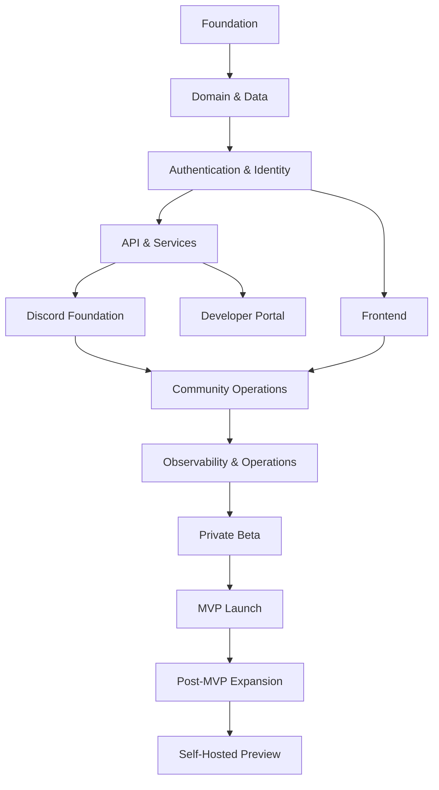

# Roadmap

Aerealith AI is built through milestone-based releases.

The roadmap is intentionally milestone-driven rather than date-driven. A release should move forward when its foundations, dependencies, testing, documentation, and exit criteria are strong enough to support the next stage.

The goal is not to rush toward launch.

The goal is to build a trustworthy platform that can grow for years without losing its foundation.

---

## Roadmap Philosophy

Aerealith exists to reduce digital complexity without reducing user control.

The roadmap follows that principle by building the platform in layers:

1. Establish the engineering foundation.
2. Define the core domain and data model.
3. Build secure identity and access.
4. Deliver the unified frontend experience.
5. Establish APIs and service architecture.
6. Build developer and integration foundations.
7. Launch Discord as the first flagship platform surface.
8. Deliver core community-management capabilities.
9. Harden observability and operations.
10. Enter private beta.
11. Launch the MVP.
12. Expand into billing, AI, automation, marketplace, companion apps, advanced integrations, and self-hosting.

Each release should make the platform more capable without making it unnecessarily complicated.

---

## Strategic Direction

Aerealith is larger than any single product surface.

The web application and Discord platform are the first major user-facing experiences, but they are not the whole platform.

Aerealith should eventually support:

- Web application
- Discord platform
- Developer APIs
- Automation workflows
- AI assistant and memory
- Marketplace modules
- Mobile and desktop companions
- Advanced integrations
- Self-hosted deployments

Discord is the first flagship proof that Aerealith can unify real communities, workflows, automation, moderation, support, analytics, and AI assistance through one modular platform.

---

## Release Flow

```mermaid
flowchart TD
    R01["0.1 — Foundation & Workspace"]
    R02["0.2 — Core Domain & Data Platform"]
    R03["0.3 — Authentication & Identity"]
    R04["0.4 — Frontend Platform"]
    R05["0.5 — API & Service Platform"]
    R06["0.6 — Developer Portal & Integrations"]
    R07["0.7 — Discord Platform Foundation"]
    R08["0.8 — Moderation, Tickets & Community Operations"]
    R09["0.9 — Observability, Reliability & Operations"]
    R10["1.0 — Private Beta"]
    R11["1.1 — MVP Production Launch"]

    R12["1.2 — Billing, Entitlements & Plans"]
    R13["1.3 — AI Assistant & Memory Foundation"]
    R14["1.4 — Workflow Automation Builder"]
    R15["1.5 — Marketplace & Module Ecosystem"]
    R16["1.6 — Mobile/Desktop Companion"]
    R17["1.7 — Digital Life OS Expansion"]
    R18["1.8 — Advanced Integrations & Ecosystem Growth"]
    R19["1.9 — Cloud Independence & Self-Hosting Foundations"]
    R20["2.0 — Self-Hosted Preview"]

    R01 --> R02 --> R03 --> R04 --> R05 --> R06 --> R07 --> R08 --> R09 --> R10 --> R11
    R11 --> R12 --> R13 --> R14 --> R15 --> R16 --> R17 --> R18 --> R19 --> R20
```

---

# 0.x Foundation Roadmap

The `0.x` releases establish the platform foundation required before Aerealith can safely support external users.

These releases focus on workspace structure, shared domain models, authentication, frontend foundations, APIs, integrations, Discord infrastructure, core community operations, and production observability.

---

## 0.1 — Foundation & Workspace

**Status:** Planned
**Theme:** Engineering foundation

Release `0.1` establishes the technical workspace that all future development depends on.

### Strategic Goal

Create a reliable, enforceable, well-documented development foundation for Aerealith AI.

### Focus Areas

- Nx monorepo structure
- pnpm workspace setup
- Node.js and TypeScript standards
- ESLint, Prettier, and Commitlint
- Shared library boundaries
- Core library conventions
- GitHub Actions baseline
- Docker foundations
- Local development documentation

### Success Criteria

Aerealith can be installed, validated, linted, type checked, tested, and built reliably in CI.

The workspace should be stable enough to support service development without architectural confusion.

---

## 0.2 — Core Domain & Data Platform

**Status:** Planned
**Theme:** Shared domain and persistence foundation

Release `0.2` defines the shared data model and database foundation used by Aerealith services.

### Strategic Goal

Create stable domain contracts, validation schemas, database models, and persistence patterns.

### Focus Areas

- Core entities
- Shared enums
- Zod schemas
- Contracts
- Error codes
- Database library
- Repositories
- Migrations
- CockroachDB configuration
- User, account, profile, preference, consent, session, and waitlist models

### Success Criteria

Core domain entities have stable contracts and validation.

Database migrations can be safely executed across preview, staging, and production environments.

---

## 0.3 — Authentication & Identity

**Status:** Planned
**Theme:** Secure identity foundation

Release `0.3` delivers user identity, account access, and session management.

### Strategic Goal

Allow users to securely create, verify, access, and manage Aerealith accounts.

### Focus Areas

- Sign-up
- Login
- Logout
- Token refresh
- Email verification
- Resend verification
- User lookup
- Account lifecycle
- Session handling
- Consent capture
- Role and permission foundations
- Authorization foundations

### Success Criteria

Users can securely authenticate.

Protected APIs consistently enforce authorization.

Authentication flows are covered by unit, integration, and end-to-end tests.

---

## 0.4 — Frontend Platform

**Status:** Planned
**Theme:** Unified web experience

Release `0.4` establishes the primary Aerealith web platform.

### Strategic Goal

Create the unified frontend shell for the website, app, documentation, and developer portal.

### Focus Areas

- Vite frontend foundation
- React
- React Router
- Tailwind CSS
- TanStack tooling
- Public website shell
- Authenticated web app shell
- Documentation shell
- Developer portal shell
- Shared UI library
- Theme system
- Accessibility standards
- User profile and settings screens
- Frontend observability

### Success Criteria

The website and application share a coherent design system.

Core account workflows are usable end to end.

The frontend has baseline accessibility, testing, and observability support.

---

## 0.5 — API & Service Platform

**Status:** Planned
**Theme:** Service and API foundation

Release `0.5` establishes the service architecture and public API foundation.

### Strategic Goal

Create consistent service patterns that can support the long-term Aerealith platform.

### Focus Areas

- Hono-based microservice conventions
- Service templates
- HTTP APIs
- tRPC foundations
- GraphQL foundations where appropriate
- WebSocket foundations where appropriate
- Versioned service routing under `/V1/services`
- API contracts
- Validation
- Consistent error responses
- Service health checks
- Configuration standards
- Local development support

### Success Criteria

Auth and User services are deployable and independently testable.

API documentation reflects implemented contracts.

Services share consistent validation, observability, and error behavior.

---

## 0.6 — Developer Portal & Integrations

**Status:** Planned
**Theme:** Developer and integration experience

Release `0.6` establishes the developer-facing platform experience.

### Strategic Goal

Make Aerealith understandable, integratable, and extensible for developers.

### Focus Areas

- Developer portal information architecture
- API reference
- Authentication guides
- Integration setup guides
- API keys
- Webhooks
- Connection flows
- SDK/client-generation strategy
- Integration diagnostics
- Developer support foundations

### Success Criteria

Developers can discover, authenticate with, and integrate against Aerealith APIs.

Core integrations have complete setup documentation.

Portal content is versioned and reviewed alongside implementation changes.

---

## 0.7 — Discord Platform Foundation

**Status:** Planned
**Theme:** First flagship platform surface

Release `0.7` establishes Discord as a first-class Aerealith platform integration.

### Strategic Goal

Allow Discord communities to install, link, configure, and manage Aerealith through the platform.

### Focus Areas

- Official Discord application
- Discord bot architecture
- Bot installation flow
- Guild linking
- Guild configuration
- Permission mapping
- Role mapping
- Channel sync
- Interaction handling
- Slash commands
- Event handling
- Module enable/disable system
- Discord audit-log conventions
- Backend integration with Aerealith services

### Success Criteria

A Discord server can install and configure the Aerealith AI bot.

Module lifecycle and permissions are reliable.

Discord interactions are observable, testable, and safely authorized.

---

## 0.8 — Moderation, Tickets & Community Operations

**Status:** Planned
**Theme:** Core Discord community operations

Release `0.8` delivers the first major Discord community-management capabilities.

### Strategic Goal

Allow communities to run moderation and support operations through Aerealith.

### Focus Areas

- Moderation tools
- Automod rules
- Warnings
- Temporary actions
- Moderation logs
- Ticket workflows
- Staff assignment
- Ticket transcripts
- Escalation handling
- Role automation
- Welcome flows
- Verification
- Server onboarding
- Community configuration UI
- Operational dashboards
- Moderation audit requirements
- Data retention and consent rules

### Success Criteria

Communities can manage moderation, tickets, roles, onboarding, and support workflows through Aerealith.

Staff actions are auditable and access controlled.

Ticket and moderation flows are validated through automated tests.

---

## 0.9 — Observability, Reliability & Operations

**Status:** Planned
**Theme:** Production readiness foundation

Release `0.9` makes the platform measurable, diagnosable, and operationally reliable.

### Strategic Goal

Ensure Aerealith can be operated responsibly before private beta.

### Focus Areas

- Structured logging
- Metrics
- Tracing
- Grafana Cloud integration
- Frontend telemetry
- Error reporting
- Health checks
- Readiness checks
- Dashboards
- Alerts
- Backup procedures
- Recovery procedures
- Incident response
- Rollback procedures
- Performance baselines
- Load-testing strategy

### Success Criteria

Production services have actionable dashboards and alerts.

Critical workflows can be traced across frontend, API, and service layers.

Operational documentation supports diagnosis and recovery.

---

# 1.x Product Roadmap

The `1.x` releases move Aerealith from private beta into public launch and then into broader platform expansion.

---

## 1.0 — Private Beta

**Status:** Planned
**Theme:** Controlled external use

Release `1.0` prepares Aerealith for invited external users and communities.

### Strategic Goal

Validate the platform with real users while maintaining controlled scope, support, and risk.

### Focus Areas

- Invited user onboarding
- Invited Discord community onboarding
- Production environment hardening
- Deployment validation
- Security review
- Privacy review
- Reliability review
- Performance review
- Feedback collection
- Issue triage
- Release communication workflow
- Beta documentation
- Support process
- Success metrics

### Required Before Private Beta

- Account creation and login
- User dashboard
- Discord bot install flow
- Discord server linking
- Module enable/disable system
- Basic moderation
- Basic tickets
- Logging and audit trail
- Basic observability
- Terms and privacy pages
- Admin and support workflow

### Success Criteria

Invited users can onboard without developer intervention.

Core web, API, and Discord flows operate reliably in production.

Known beta risks, support paths, and rollback procedures are documented.

---

## 1.1 — MVP Production Launch

**Status:** Planned
**Theme:** First public product release

Release `1.1` launches the first public Aerealith AI product version.

### Strategic Goal

Make Aerealith publicly available with stable account, web, API, and Discord platform capabilities.

### Focus Areas

- Public availability
- Production readiness
- Launch communications
- Stable account system
- Stable user dashboard
- Stable Discord platform features
- API foundations
- Documentation
- Support operations
- Usage analytics
- Post-launch monitoring
- Basic plans and entitlement foundations

### Billing Scope

Release `1.1` should include basic plans and entitlement foundations.

Full billing and subscription maturity may continue in later releases.

### Success Criteria

The platform meets defined reliability, security, and support standards.

Public onboarding, documentation, and operational processes are complete.

Launch-blocking defects are resolved or formally accepted.

---

## 1.2 — Billing, Entitlements & Plans

**Status:** Planned
**Theme:** Monetization foundation

Release `1.2` strengthens the business and entitlement foundation.

### Strategic Goal

Create a clear, trustworthy, and scalable plan system without compromising user trust.

### Focus Areas

- Plans
- Tiers
- Entitlements
- Usage limits
- Payment integration
- Subscription lifecycle
- Billing dashboard
- Invoices and receipts
- Upgrade/downgrade flows
- Grace periods
- Access control based on entitlements
- Billing-related notifications

### Success Criteria

Users and communities can understand, manage, and change their plan.

Entitlements are enforced consistently across services and modules.

Billing behavior remains transparent and non-manipulative.

---

## 1.3 — AI Assistant & Memory Foundation

**Status:** Planned
**Theme:** Personal intelligence foundation

Release `1.3` introduces the foundation for Aerealith as an intelligent assistant platform.

### Strategic Goal

Create user-controlled AI assistance, memory, and context foundations.

### Focus Areas

- Assistant identity
- User-controlled memory
- Memory review
- Memory edit/delete/export
- AI provider routing
- First-party model strategy
- External model provider support
- Local model compatibility path
- Context management
- Explainability
- User preference learning
- AI action transparency

### Success Criteria

Users can interact with Aerealith as a trusted assistant.

Memory remains visible, editable, exportable, and deletable.

AI behavior is explainable and permission-aware.

---

## 1.4 — Workflow Automation Builder

**Status:** Planned
**Theme:** User-controlled automation

Release `1.4` introduces deeper workflow automation capabilities.

### Strategic Goal

Allow users and communities to define reusable workflows while preserving approval, transparency, and control.

### Focus Areas

- Workflow builder
- Trigger system
- Conditions
- Actions
- Approval gates
- Notification routing
- Workflow history
- Dry runs
- Permission manifests
- Automation recommendations
- Progressive Trust automation flow
- Workflow templates
- Webhooks

### Success Criteria

Users can create and manage workflows safely.

Aerealith can recommend automation after repeated approved behavior.

Workflows are auditable, reversible where possible, and permission-scoped.

---

## 1.5 — Marketplace & Module Ecosystem

**Status:** Planned
**Theme:** Extensible platform growth

Release `1.5` begins transforming Aerealith into an ecosystem.

### Strategic Goal

Allow first-party and third-party capabilities to expand the platform safely.

### Focus Areas

- Module marketplace
- Workflow marketplace
- Integration marketplace
- Theme marketplace
- AI skill marketplace
- Private sharing links
- Organization-private libraries
- Reviews and ratings
- Versioning
- Security scanning
- Permission review
- Installation approval
- Developer publishing workflow

### Success Criteria

Users can discover, install, review, and manage platform extensions.

Extensions follow permission, safety, versioning, and review requirements.

Developers can begin building on Aerealith without modifying the core platform.

---

## 1.6 — Mobile/Desktop Companion

**Status:** Planned
**Theme:** Companion surfaces

Release `1.6` expands Aerealith beyond the web and Discord.

### Strategic Goal

Make Aerealith available where users already work and communicate.

### Focus Areas

- Desktop companion
- Mobile companion
- Notifications
- Quick actions
- Approval prompts
- Status monitoring
- Assistant access
- Workflow controls
- Local context awareness where appropriate
- Offline-aware behavior

### Success Criteria

Users can approve, review, and interact with Aerealith outside the main web app.

Companion apps improve access without creating notification overload.

---

## 1.7 — Digital Life OS Expansion

**Status:** Planned
**Theme:** Broader digital-life management

Release `1.7` expands Aerealith toward its long-term identity as the operating system for digital life.

### Strategic Goal

Move beyond the initial web and Discord experiences into broader personal and community digital-life management.

### Focus Areas

- Personal dashboard expansion
- Cross-platform activity views
- Unified notification center
- Personal workflow management
- Community workflow management
- Connected-service overview
- Unified search
- Cross-service summaries
- User-controlled context graph
- Broader assistant capabilities

### Success Criteria

Aerealith begins to feel like one cohesive control center rather than a set of separate features.

Users can understand and manage more of their digital life from one place.

---

## 1.8 — Advanced Integrations & Ecosystem Growth

**Status:** Planned
**Theme:** Integration expansion

Release `1.8` expands Aerealith's connection to the broader digital ecosystem.

### Strategic Goal

Increase platform value by connecting Aerealith to more systems while preserving cohesion and user control.

### Focus Areas

- GitHub integration
- Google integration
- Cloudflare integration
- Grafana integration
- Home Assistant integration
- Developer-built integration templates
- Advanced webhooks
- Richer API ecosystem
- Advanced notification routing
- Integration diagnostics
- Integration health monitoring
- Cross-integration workflow support

### Success Criteria

Aerealith can connect more of the user's digital ecosystem into one platform.

Integrations remain modular, permissioned, observable, and replaceable.

---

## 1.9 — Cloud Independence & Self-Hosting Foundations

**Status:** Planned
**Theme:** Preparing for self-hosting

Release `1.9` prepares Aerealith for future self-hosted operation.

### Strategic Goal

Harden provider abstraction, deployment portability, and infrastructure independence before self-hosted preview.

### Focus Areas

- Docker Compose reference deployment
- Provider abstraction hardening
- Resend to SMTP compatibility path
- Cloudinary to S3/MinIO compatibility path
- Grafana Cloud to Grafana OSS compatibility path
- AI provider routing
- Local model support path
- Environment export/import
- Backup and restore foundation
- Secrets management documentation
- Deployment documentation
- Self-hosting architecture review

### Success Criteria

Major hosted dependencies have documented replacement paths.

Aerealith can be packaged, configured, and tested in a portable deployment model.

The platform is prepared for a realistic self-hosted preview.

---

# 2.x Roadmap

The `2.x` roadmap begins the transition from hosted-first platform to serious self-hosted and deployment-flexible platform.

---

## 2.0 — Self-Hosted Preview

**Status:** Planned
**Theme:** Deployment independence

Release `2.0` introduces the first supported self-hosted preview of Aerealith.

### Strategic Goal

Allow users, communities, and organizations to deploy Aerealith in their own environment.

### Focus Areas

- Self-hosted preview release
- Docker Compose deployment
- Environment setup documentation
- Database setup
- Storage setup
- Email setup
- Observability setup
- AI provider configuration
- Backup and restore documentation
- Upgrade process
- Known limitations
- Security guidance

### Success Criteria

A technically capable user or organization can deploy Aerealith without internal developer assistance.

Self-hosted deployment is documented, testable, upgradeable, and honest about limitations.

---

# Roadmap Dependency Model

---

# Roadmap Rules

## Milestones Over Dates

Aerealith releases should be milestone-based, not date-based, until scheduling becomes realistic.

A release should not ship because a date arrived.

A release should ship because its exit criteria are satisfied.

---

## Quality Before Expansion

Aerealith should not expand into new product areas before the foundation can support them.

Every expansion should preserve:

- trust
- security
- user control
- transparency
- modularity
- extensibility
- observability
- maintainability

---

## Discord First, Not Discord Only

Discord is the first flagship product surface.

It is not the entire platform.

The Discord platform should prove that Aerealith can manage real communities through modular automation, permissions, dashboards, AI assistance, and operational visibility.

The lessons learned from Discord should strengthen the broader Aerealith platform.

---

## Docker Early, Self-Hosting Later

Every deployable service should have a Dockerfile early.

Full self-hosting support should arrive later, after the hosted platform is stable enough to provide a reliable reference architecture.

Dockerization is a foundation.

Self-hosting is a product.

---

## APIs Are Product Surface

The API should not be treated as an internal implementation detail.

Every major capability should eventually be accessible through APIs, SDKs, workflows, modules, and AI orchestration.

---

## Plans Before Full Billing

Basic plans and entitlement foundations should exist by MVP launch.

Full billing maturity can continue after launch.

Billing must remain transparent, understandable, and free from dark patterns.

---

# Long-Term Direction

Aerealith should grow into a trusted, extensible operating system for digital life.

It should become a platform where:

- individuals manage their digital lives
- communities manage their online spaces
- developers build modules and integrations
- organizations manage workflows and permissions
- AI assists without taking control
- automation is earned through trust
- data remains owned by users and communities
- deployment can move from cloud to self-hosted when needed

The roadmap is not only a sequence of releases.

It is the path toward a more cohesive digital world.

---

# North Star

Reduce digital complexity without reducing user control.
