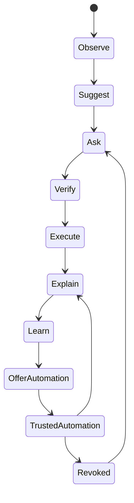
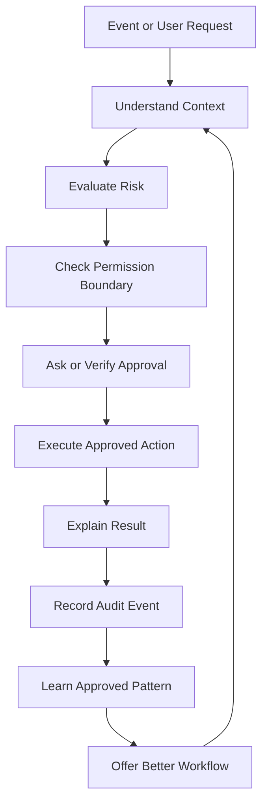
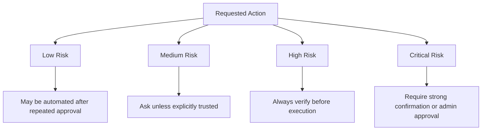
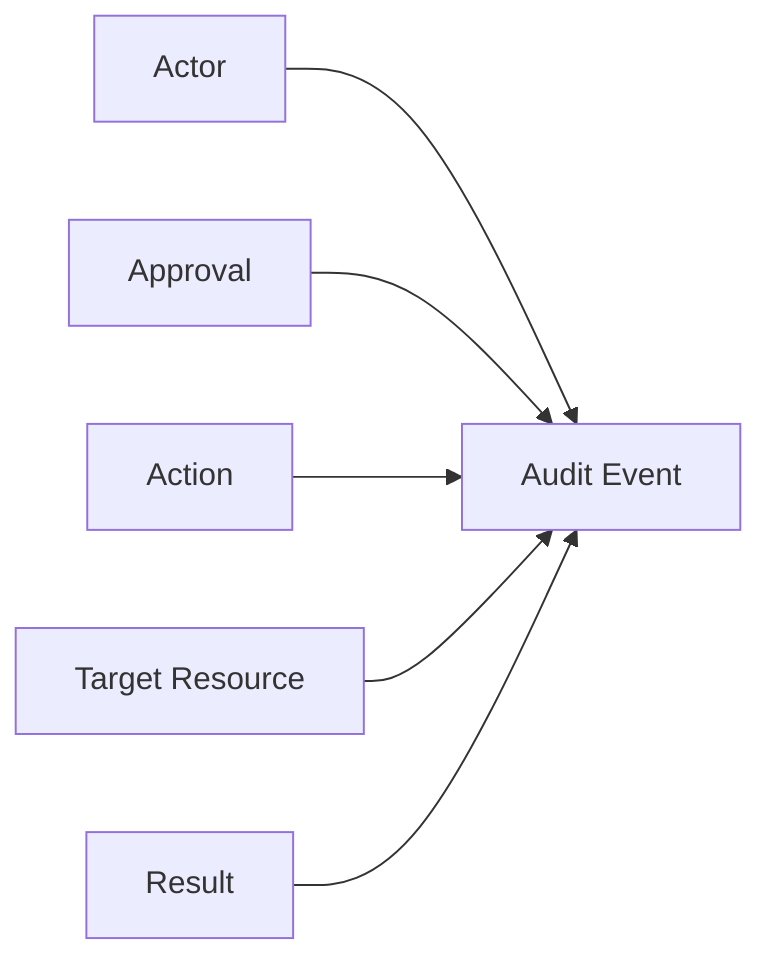
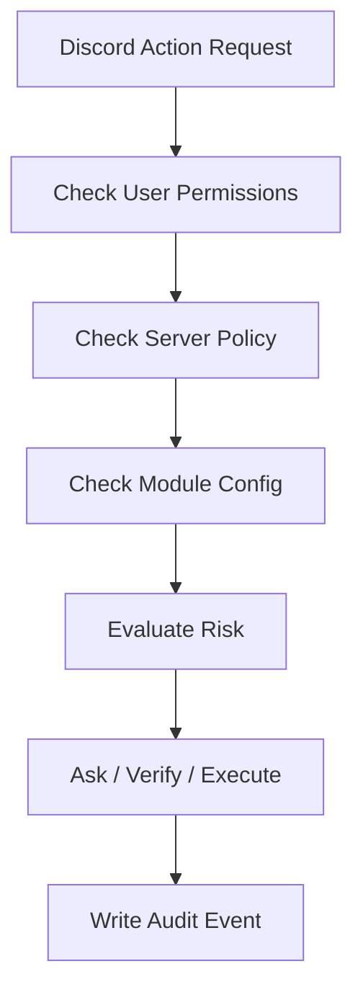

# Trust Model

Aerealith AI is built on progressive trust.

Trust is not assumed by default. It is earned through transparent behavior, repeated user approval, clear permission boundaries, auditability, and the ability for users to revoke access or automation at any time.

The Trust Model defines how Aerealith should request permission, verify intent, execute actions, explain outcomes, learn patterns, and offer automation without taking control away from the user.

---

## Purpose

The purpose of the Trust Model is to ensure that every meaningful action in Aerealith remains:

- user-approved
- understandable
- permission-scoped
- auditable
- reversible when possible
- revocable at any time
- aligned with user intent

Aerealith should never silently escalate from assistance to control.

---

## Core Trust Principle

> Aerealith should earn trust before receiving control.

The platform should begin by helping users understand and approve actions. Only after repeated user-approved behavior should Aerealith offer automation.

Automation is not the default.

Automation is earned.

---

## Progressive Trust Flow



---

## Trust Stages

| Stage | Name               | Description                                                                                 |
| ----: | ------------------ | ------------------------------------------------------------------------------------------- |
|     1 | Observe            | Aerealith notices patterns, behavior, events, or system states without acting.              |
|     2 | Suggest            | Aerealith recommends a possible action.                                                     |
|     3 | Ask                | Aerealith asks the user for permission to act.                                              |
|     4 | Verify             | Aerealith confirms user intent, especially when risk is present.                            |
|     5 | Execute            | Aerealith performs the approved action within the granted boundary.                         |
|     6 | Explain            | Aerealith explains what happened, why it happened, what changed, and what can be done next. |
|     7 | Learn              | Aerealith records repeated approved patterns when appropriate and permitted.                |
|     8 | Offer Automation   | Aerealith offers to automate a repeated approved action.                                    |
|     9 | Trusted Automation | Aerealith performs the action automatically within approved rules and limits.               |
|    10 | Revoke             | The user can pause, disable, edit, or revoke the automation at any time.                    |

---

## The Trust Loop

Aerealith should treat trust as a continuous loop, not a one-time permission grant.



---

## Permission Levels

Aerealith permissions should be more expressive than simple allow or deny.

| Permission Level        | Meaning                                                                                    |
| ----------------------- | ------------------------------------------------------------------------------------------ |
| Never                   | Aerealith may not perform this action.                                                     |
| Ask Every Time          | Aerealith must request approval every time.                                                |
| Ask When Different      | Aerealith may act only when the situation matches previously approved behavior.            |
| One-Time Approval       | Aerealith may perform the approved action once.                                            |
| Time-Limited Approval   | Aerealith may perform the action within a specific time window.                            |
| Scoped Approval         | Aerealith may act only within a specific service, module, project, community, or workflow. |
| Trusted Automation      | Aerealith may perform the action automatically within defined boundaries.                  |
| Emergency Only          | Aerealith may act only under explicitly defined urgent conditions.                         |
| Admin Approval Required | Aerealith requires elevated approval before acting.                                        |
| Blocked by Policy       | Aerealith may not perform the action due to user, organization, safety, or legal policy.   |

---

## Risk Levels

Actions should be evaluated by risk before execution.



| Risk Level | Examples                                                              | Default Behavior                                    |
| ---------- | --------------------------------------------------------------------- | --------------------------------------------------- |
| Low        | Formatting, summaries, reminders, harmless notifications              | Can be automated after repeated approval            |
| Medium     | Posting messages, changing settings, updating workflows               | Ask or verify depending on trust history            |
| High       | Moderation actions, deleting records, changing permissions            | Always verify before execution                      |
| Critical   | Billing changes, security changes, destructive infrastructure actions | Require explicit confirmation and elevated approval |

---

## Approval Requirements

Aerealith should require approval when an action:

- changes data
- deletes data
- modifies permissions
- affects billing
- affects security
- posts publicly
- messages users
- moderates users
- changes infrastructure
- exposes private information
- connects or disconnects integrations
- creates long-running automation
- cannot be easily reversed

When unsure, Aerealith should ask.

---

## Verify Before Action

Verification is required when the consequences matter.

Aerealith should verify:

- what the user wants
- what system will be affected
- what data will change
- whether the action is reversible
- whether the action matches prior approved behavior
- whether the user has permission
- whether organization or community policy allows it
- whether the action has unusual risk

Example:

```text
You asked me to delete the ticket transcript archive.

This appears to be the only stored copy for 48 closed tickets.

Do you want to permanently delete it?
```

---

## Explain After Action

After completing a meaningful action, Aerealith should explain the result.

A good explanation should answer:

- What happened?
- Why did it happen?
- What changed?
- What systems were affected?
- Was it successful?
- Was anything skipped or failed?
- Can it be reversed?
- What should the user do next?

Example:

```text
I restarted the Minecraft server because the health check failed three times in a row.

What changed:
- The server process restarted.
- 4 active players were notified.
- The latest backup was verified before restart.
- The server returned healthy after 18 seconds.

You can view logs, undo the automation, or disable future restart suggestions.
```

---

## Auditability

Every meaningful action should produce an audit event.

Audit events should include:

- action type
- user or system actor
- approval source
- permission boundary
- affected service
- affected resource
- timestamp
- result
- failure reason, if any
- reversal status, if reversible
- related workflow or automation
- related AI decision, if applicable



---

## Automation Eligibility

Aerealith should only offer automation when there is enough repeated approved behavior.

Automation may be suggested when:

- the same action has been approved multiple times
- the context is consistent
- the user has not recently denied the action
- the risk level is acceptable
- the action has a clear rollback or stop path
- the permission boundary can be clearly defined
- the automation can be audited
- the user can revoke it easily

Automation should not be suggested when:

- the user has denied similar actions
- the action is destructive
- the action is high-risk or critical
- the context varies too much
- the result is difficult to reverse
- the user seems uncertain
- organization policy blocks automation
- the action could cause harm

---

## Suggested Automation Thresholds

These thresholds are starting guidance, not permanent rules.

| Action Type                     |             Suggested Threshold |
| ------------------------------- | ------------------------------: |
| Low-risk repeated task          |                     3 approvals |
| Notification routing            |                     3 approvals |
| Repeated report generation      |                     3 approvals |
| Workflow cleanup                |                     5 approvals |
| Community moderation suggestion |                     5 approvals |
| Infrastructure restart          |                     8 approvals |
| Permission changes              | Never fully automate by default |
| Billing actions                 | Never fully automate by default |
| Destructive actions             | Never fully automate by default |
| Security-sensitive actions      | Never fully automate by default |

---

## Trusted Automation Boundaries

Trusted automation must always have boundaries.

A trusted automation should define:

- what action may run
- when it may run
- where it may run
- what systems it may access
- what data it may use
- what risk level it covers
- what approval created it
- how often it may run
- what should trigger escalation
- how users can pause or revoke it
- what audit events it emits

Trusted automation should never become unlimited permission.

---

## Revocation

Every automation and permission should be revocable.

Users should be able to:

- pause automation
- disable automation
- delete automation
- lower the permission level
- change approval requirements
- revoke integration access
- view history
- export records
- delete stored automation state where appropriate

Revocation should be easy to find and easy to understand.

---

## Trust by Context

Trust is scoped.

Approval in one context does not automatically transfer to another context.

| Context           | Trust Boundary                                                    |
| ----------------- | ----------------------------------------------------------------- |
| Personal account  | User-owned actions and workflows                                  |
| Discord community | Community-specific roles, permissions, modules, and policies      |
| Organization      | Organization policies, compliance rules, and admin approval       |
| Project           | Project-scoped workflows, files, tools, and automation            |
| Infrastructure    | Environment-specific operations and deployment risk               |
| Billing           | Plan, payment, entitlement, and invoice-related actions           |
| Security          | Identity, access, secrets, credentials, and permission boundaries |

A user approving an action in one Discord server does not mean Aerealith can perform it in every server.

A user approving an action in development does not mean Aerealith can perform it in production.

---

## Discord Trust Model

Discord communities require special care because actions affect many people.

Aerealith should verify and audit actions involving:

- bans
- kicks
- timeouts
- warnings
- role changes
- permission changes
- ticket deletions
- transcript access
- public announcements
- mass message deletion
- automod escalation
- server lockdowns
- channel changes

Discord automation should respect:

- server owner permissions
- admin configuration
- moderator roles
- module settings
- channel restrictions
- audit requirements
- community policy
- Discord platform rules



---

## AI Trust Model

AI must operate within the same trust boundaries as every other system.

AI should not receive special permission simply because it is intelligent.

AI actions should be:

- explainable
- permissioned
- scoped
- logged
- reversible where possible
- blocked when unsafe
- honest about uncertainty

AI should never:

- hide actions
- pretend certainty
- deceive users
- bypass permissions
- silently escalate access
- use private data for training without explicit consent
- act outside approved boundaries

---

## Human Override

Users should be able to override AI recommendations.

Aerealith may warn users when an override appears risky, but the user should remain in control unless the requested action would violate safety, law, platform integrity, or another user's rights.

Override events should be auditable when they affect meaningful systems.

---

## Failure Behavior

Failure should never be hidden.

When something fails, Aerealith should:

- explain the failure
- describe what was attempted
- show what changed, if anything
- identify what did not complete
- suggest next steps
- avoid repeating dangerous actions
- escalate when appropriate
- record the failure in audit logs

Failure should become part of the trust loop.

---

## Trust Metrics

Aerealith may track trust-related signals to improve recommendations and automation suggestions.

Possible metrics include:

| Metric               | Purpose                                                |
| -------------------- | ------------------------------------------------------ |
| approval_count       | Number of times the user approved an action            |
| denial_count         | Number of times the user denied an action              |
| reversal_count       | Number of times the action was reversed                |
| failure_count        | Number of times the action failed                      |
| context_match_score  | How closely the current context matches past approvals |
| risk_score           | Estimated risk of the action                           |
| confidence_score     | Confidence that the action matches user intent         |
| automation_readiness | Whether automation should be suggested                 |
| last_approved_at     | Most recent approval timestamp                         |
| last_denied_at       | Most recent denial timestamp                           |

These metrics should support the user.

They should not be used to pressure users into automation.

---

## Trust Model Data Shape

Example internal representation:

```json
{
  "id": "trust_record_...",
  "tenant_id": "tenant_...",
  "user_id": "user_...",
  "scope": "personal | community | organization | project | infrastructure",
  "action": "restart_service",
  "target": {
    "type": "service",
    "id": "minecraft_server"
  },
  "risk_level": "medium",
  "permission_level": "ask_every_time",
  "approval": {
    "status": "approved",
    "approved_by": "user_...",
    "approved_at": "2026-01-01T00:00:00Z",
    "verification_required": true
  },
  "automation": {
    "eligible": true,
    "enabled": false,
    "approval_count": 8,
    "denial_count": 0,
    "threshold": 8
  },
  "audit": {
    "audit_event_ids": []
  }
}
```

---

## Trust Model Rules

Aerealith must follow these rules:

1. Never assume correctness.
2. Never take unapproved meaningful actions.
3. Always verify risky actions.
4. Always explain meaningful outcomes.
5. Always create audit records for meaningful actions.
6. Always allow permissions and automations to be revoked.
7. Never use private data for training without explicit consent.
8. Never hide AI involvement.
9. Never escalate permission silently.
10. Never prioritize convenience over user trust.

---

## The Trust Test

Before shipping a feature, ask:

- Does this require user approval?
- Is the permission boundary clear?
- Can the user revoke it?
- Can the action be audited?
- Can the result be explained?
- Can the user understand what changed?
- Can this be reversed where practical?
- Could this surprise the user?
- Could this harm trust?
- Would we still defend this behavior ten years from now?

If the feature weakens trust, it should be redesigned.

---

## Final Standard

Aerealith succeeds when users trust it with important parts of their digital lives.

That trust must be earned repeatedly.

Every action.

Every automation.

Every integration.

Every release.

Trust is the product foundation.
