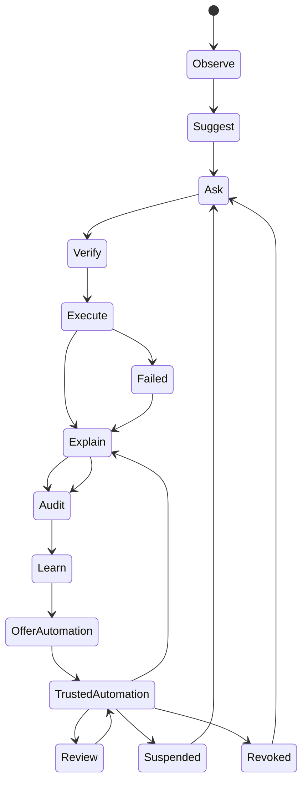
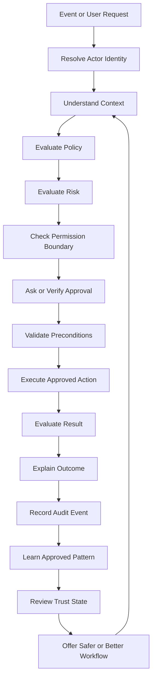
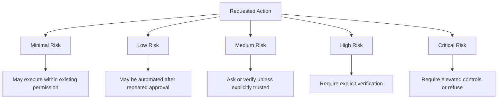
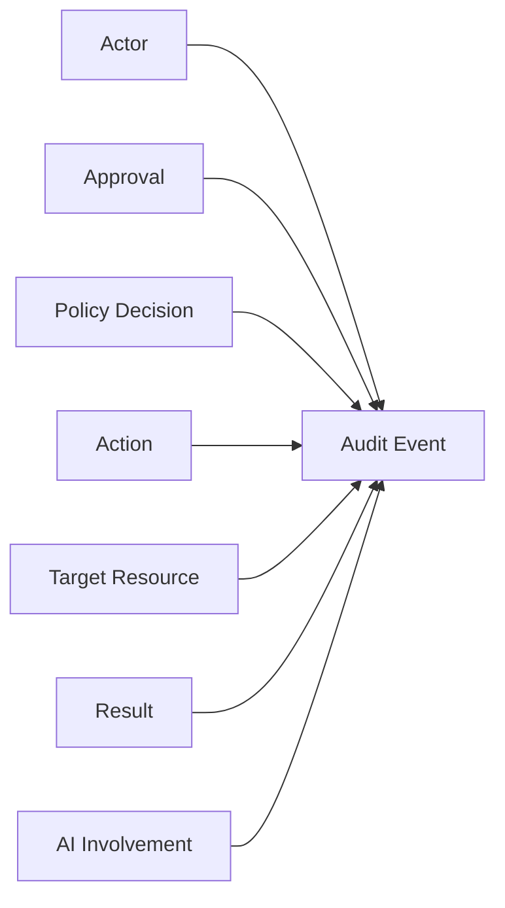
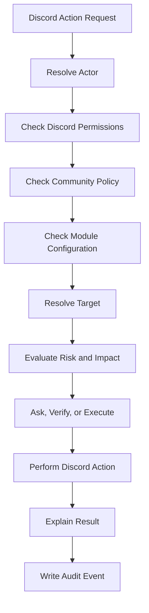

# Trust Model

Status: Active
Owner: SinLess Games LLC
Last Updated: 2026-07-17
Document Type: Vision and Product Governance

## Purpose

This document defines how trust should be established, expanded, reviewed, and
revoked across Aerealith.

It governs how the platform should:

- Request permission
- Verify intent
- Evaluate risk
- Execute actions
- Explain outcomes
- Record audit events
- Learn from approved behavior
- Offer automation
- Enforce automation boundaries
- Respond to failures
- Support revocation and recovery

The Trust Model applies to:

- Aerealith platform services
- Aerealith AI
- First-party modules
- Third-party modules
- Integrations
- Workflows
- Automations
- Administrative tools
- Community operations
- Infrastructure operations
- Developer interfaces

Trust is not assumed by default.

It is earned through transparent behavior, repeated user approval, explicit
permission boundaries, reliable execution, auditability, and the ability to
pause or revoke access at any time.

---

## Canonical Product Distinction

### Aerealith

**Aerealith** is the platform.

It provides the shared identity, permissions, policy, workflow, integration,
automation, audit, security, and orchestration foundations through which actions
are evaluated and executed.

### Aerealith AI

**Aerealith AI** is the intelligent assistant within the platform.

It may interpret requests, gather context, recommend actions, explain outcomes,
and coordinate approved workflows.

Aerealith AI does not possess independent authority.

It must operate through the same permission, policy, validation, audit, and risk
controls as every other platform actor.

> **Aerealith defines and enforces trust boundaries.**
>
> **Aerealith AI operates within those boundaries.**

---

## Core Trust Principle

> **Aerealith should earn trust before receiving authority.**

The platform should begin by helping users understand and approve actions.

Only after repeated, consistent, user-approved behavior should Aerealith offer
automation.

Automation is not the default.

Automation is earned.

A previous approval must not silently become unlimited future authority.

---

## Trust Objectives

Every meaningful action in Aerealith should remain:

- Authorized
- Understandable
- Permission-scoped
- Policy-compliant
- Risk-aware
- Auditable
- Reversible where practical
- Revocable
- Attributable
- Aligned with user intent
- Honest about uncertainty
- Recoverable when failure occurs

Aerealith should never silently escalate from assistance to control.

---

## Trust Is Continuous

Trust is not a one-time checkbox.

It is a continuously evaluated relationship between:

- An actor
- An action
- A target
- A context
- A permission
- A policy
- A risk level
- An approval
- A result
- A history of prior behavior

A user may trust one action in one context without trusting that action
everywhere.

A system may be trusted today but require re-verification after permissions,
targets, risk, ownership, configuration, or policy changes.

Trust should be re-evaluated whenever meaningful context changes.

---

# Progressive Trust Model

## Progressive Trust Flow



---

## Trust Stages

| Stage | Name               | Description                                                                                      |
| ----: | ------------------ | ------------------------------------------------------------------------------------------------ |
|     1 | Observe            | Aerealith notices events, patterns, requests, or system states without taking meaningful action. |
|     2 | Suggest            | Aerealith recommends a possible action and explains why it may be useful.                        |
|     3 | Ask                | Aerealith requests permission to perform a clearly defined action.                               |
|     4 | Verify             | Aerealith confirms identity, intent, authority, target, consequences, and risk.                  |
|     5 | Execute            | Aerealith performs the approved action within the authorized boundary.                           |
|     6 | Explain            | Aerealith describes what happened, what changed, and what the user can do next.                  |
|     7 | Audit              | Aerealith records the actor, approval, target, action, result, and relevant context.             |
|     8 | Learn              | Aerealith records approved patterns where permitted and appropriate.                             |
|     9 | Offer Automation   | Aerealith proposes a bounded automation based on repeated approved behavior.                     |
|    10 | Trusted Automation | Aerealith performs the action automatically within explicit rules and limits.                    |
|    11 | Review             | The user or administrator reviews automation performance, scope, and continued suitability.      |
|    12 | Suspend or Revoke  | The automation is paused, restricted, disabled, or deleted.                                      |

These stages are not a guarantee of linear progression.

Aerealith may move backward when:

- Risk increases
- Context changes
- A user denies an action
- Permissions change
- A policy changes
- Ownership changes
- An automation fails
- A security event occurs
- The target changes
- The action becomes less reversible
- Confidence in user intent decreases

---

## The Trust Loop



The trust loop should continue after execution.

A successful action does not permanently validate all future actions of the same
type.

---

# Trust Dimensions

A trust decision should evaluate more than whether an action is technically
allowed.

Relevant dimensions include:

- **Identity** — Who or what is requesting the action?
- **Authority** — Does the actor have permission to approve it?
- **Intent** — Is the requested outcome sufficiently clear?
- **Scope** — Which service, resource, tenant, project, or environment is involved?
- **Risk** — What harm could occur?
- **Reversibility** — Can the action be undone?
- **Sensitivity** — Does the action involve private, regulated, or security-sensitive data?
- **Context** — Does the situation match prior approved behavior?
- **Policy** — Do user, community, organization, platform, or legal rules allow it?
- **Confidence** — How certain is Aerealith that it understands the request?
- **Impact** — How many users, systems, resources, or services may be affected?
- **Frequency** — Is this a one-time action or repeated automation?
- **Time** — Is the approval still current and relevant?
- **Environment** — Is the action occurring in development, staging, or production?
- **Dependency state** — Are the connected systems healthy and trustworthy?

No single trust score should replace explicit authorization and policy checks.

---

# Permission Model

## Permission Principles

Permissions should be:

- Explicit
- Scoped
- Understandable
- Least-privileged
- Time-aware
- Context-aware
- Reviewable
- Revocable
- Auditable
- Separate from AI confidence

Aerealith should request the smallest permission necessary to complete the task.

Broad permissions should require stronger justification and clearer explanation.

---

## Permission Levels

Aerealith permissions should be more expressive than simple allow or deny.

| Permission Level        | Meaning                                                                                         |
| ----------------------- | ----------------------------------------------------------------------------------------------- |
| Never                   | Aerealith may not perform this action.                                                          |
| Suggest Only            | Aerealith may recommend the action but may not request or execute it automatically.             |
| Ask Every Time          | Aerealith must request approval before every execution.                                         |
| Ask When Different      | Aerealith may proceed only when the context matches an approved pattern; otherwise it must ask. |
| One-Time Approval       | Aerealith may perform the approved action once.                                                 |
| Session Approval        | Aerealith may act within a defined user session.                                                |
| Time-Limited Approval   | Aerealith may act within a specified time window.                                               |
| Scoped Approval         | Aerealith may act only within a named service, module, tenant, project, community, or workflow. |
| Conditional Approval    | Aerealith may act only when defined conditions are true.                                        |
| Trusted Automation      | Aerealith may act automatically within documented rules and limits.                             |
| Emergency Only          | Aerealith may act only under explicitly defined emergency conditions.                           |
| Admin Approval Required | Elevated or designated approval is required.                                                    |
| Multi-Party Approval    | More than one authorized approver is required.                                                  |
| Blocked by Policy       | The action is prohibited by user, organization, safety, platform, or legal policy.              |

---

## Permission Scope

A permission should identify:

- Actor
- Tenant
- User
- Organization
- Community
- Project
- Environment
- Service
- Resource type
- Specific resource
- Action
- Data categories
- Time window
- Allowed conditions
- Maximum frequency
- Maximum impact
- Required approval level
- Revocation status

Permissions should not be inherited across unrelated contexts without explicit
authorization.

---

## Permission Precedence

When multiple permission sources apply, the most restrictive valid rule should
generally prevail.

A typical precedence order is:

1. Law and regulatory requirements
2. Platform safety and integrity policy
3. Organization policy
4. Tenant or community policy
5. Resource-specific policy
6. Role-based permission
7. User preference
8. Workflow or automation permission
9. Prior approval history
10. AI recommendation

AI recommendations must never override a higher-level permission or policy.

---

# Risk Model

## Risk Principles

Risk should be evaluated before execution and re-evaluated when context changes.

Risk classification should consider:

- Potential harm
- Scope of impact
- Data sensitivity
- Reversibility
- Financial consequences
- Security consequences
- Number of affected users
- Production impact
- Legal or compliance impact
- Public visibility
- Confidence in intent
- Dependency reliability
- Likelihood of cascading failure

---

## Risk Levels



| Risk Level | Example Actions                                                                                                   | Default Behavior                                        |
| ---------- | ----------------------------------------------------------------------------------------------------------------- | ------------------------------------------------------- |
| Minimal    | Reading public data, formatting text, generating a draft, summarizing approved information                        | May execute within existing read permissions            |
| Low        | Creating reminders, routing notifications, generating reports, applying non-destructive labels                    | May be automated after repeated approval                |
| Medium     | Posting messages, changing non-sensitive settings, modifying workflows, creating calendar events                  | Ask or verify depending on scope and trust state        |
| High       | Moderation actions, deleting records, changing permissions, publishing externally, production changes             | Explicit verification required                          |
| Critical   | Billing changes, secret rotation, destructive infrastructure actions, broad access changes, irreversible deletion | Elevated confirmation, multi-party approval, or refusal |

Risk levels are defaults.

A normally low-risk action may become high-risk because of context, scale,
target, timing, data sensitivity, or environment.

---

## Risk Escalation Conditions

Aerealith should increase the effective risk level when:

- The action affects production
- The action targets many resources
- The action affects many users
- The request is ambiguous
- The action is unusual for the actor
- The target differs from prior approvals
- A dependency is unhealthy
- The action cannot be reversed
- Sensitive data is involved
- Authentication is stale or uncertain
- The user recently denied a similar action
- The automation recently failed
- A security incident is active
- Policies conflict
- The action crosses tenant boundaries
- The action occurs outside an approved schedule
- AI confidence is low
- The user appears confused about the consequences

---

# Approval Model

## Approval Requirements

Aerealith should normally require approval when an action:

- Creates, changes, or deletes data
- Modifies permissions
- Affects billing
- Affects security controls
- Posts publicly
- Messages another person
- Moderates a user
- Changes infrastructure
- Exposes private information
- Connects or disconnects an integration
- Creates long-running automation
- Changes automation boundaries
- Changes production configuration
- Rotates secrets
- Grants third-party access
- Cannot be easily reversed
- Has consequences beyond the requesting user

When uncertainty is meaningful, Aerealith should ask.

---

## Approval Quality

Approval should be:

- Informed
- Specific
- Attributable
- Timely
- Scoped
- Freely given
- Appropriate to the action
- Recorded when meaningful

An approval prompt should explain:

- The proposed action
- The target
- The expected outcome
- The required permission
- The primary risk
- Whether the action is reversible
- Whether the approval is one-time or reusable
- How the approval can be revoked

---

## Approval Must Not Be Manipulative

Aerealith must not:

- Preselect broader permission than necessary
- Hide a destructive consequence
- Use misleading button labels
- Bundle unrelated approvals
- Pressure users through artificial urgency
- Treat silence as consent
- Convert one-time consent into recurring permission
- Require automation to use a basic feature unless necessary
- Make revocation materially harder than approval

---

# Verification Before Action

Verification is required when consequences matter.

Aerealith should verify:

- What the user wants
- Who is authorizing it
- Whether the actor has authority
- Which system will be affected
- Which resource is targeted
- What data will change
- Whether the action is reversible
- Whether the request matches prior approved behavior
- Whether organization or community policy allows it
- Whether the action has unusual risk
- Whether the target is development, staging, or production
- Whether approval is still valid
- Whether required dependencies are healthy

Example:

```text
You asked me to permanently delete the ticket transcript archive.

This appears to be the only retained copy for 48 closed tickets and may affect
the community's retention policy.

Target:
- Community: Aerealith Development
- Archive: Closed ticket transcripts
- Records affected: 48
- Recovery: No configured backup was found

This action cannot be undone.

Type DELETE 48 TRANSCRIPTS to confirm.
```

Verification should become stronger as risk increases.

---

## Strong Confirmation

High-risk or irreversible actions may require:

- Re-entry of the target name
- A typed confirmation phrase
- Reauthentication
- Multi-factor authentication
- Administrator approval
- Multi-party approval
- A waiting period
- A second review screen
- A dry run
- A backup verification
- Confirmation through a separate trusted channel

Strong confirmation should protect users without becoming meaningless ritual.

---

# Execution Model

## Execution Requirements

Before execution, Aerealith should confirm that:

- Authorization remains valid
- Policies still permit the action
- Preconditions are satisfied
- The target still exists
- The target has not materially changed
- Required dependencies are available
- The action remains within approved scope
- Rate and impact limits will not be exceeded
- The request has not expired
- Duplicate execution will not cause harm

---

## Execution Safety

Where practical, actions should use:

- Idempotency keys
- Transactions
- Concurrency control
- Dry-run modes
- Preview
- Validation
- Rate limits
- Target allowlists
- Environment restrictions
- Timeouts
- Circuit breakers
- Safe retries
- Rollback
- Partial-failure tracking

Approval does not remove the need for technical safety controls.

---

# Explanation Model

## Explain Before Action

For meaningful actions, Aerealith should explain enough for the user to make an
informed decision.

A pre-action explanation should answer:

- What is being proposed?
- Why is it being proposed?
- What information influenced the proposal?
- Which systems are involved?
- What permissions are required?
- What will change?
- What could go wrong?
- Can it be reversed?
- What alternatives exist?

---

## Explain After Action

After completing a meaningful action, Aerealith should explain:

- What happened
- Why it happened
- What changed
- Which systems were affected
- Whether it succeeded
- Whether anything was skipped
- Whether anything failed
- Whether rollback occurred
- Whether the action can be reversed
- What audit record was created
- What the user should do next

Example:

```text
I restarted the Minecraft server because its health check failed three times
within five minutes.

What changed:
- The server process restarted.
- Four active players received a warning.
- The latest backup was verified before restart.
- The server returned healthy after 18 seconds.

What did not change:
- No world data was restored.
- No configuration files were modified.
- No player permissions were changed.

You can review the logs, disable restart automation, or change the failure
threshold.
```

---

## Explanation Honesty

Aerealith should clearly distinguish:

- Fact
- Inference
- Recommendation
- Uncertainty
- User-provided information
- Third-party system output
- AI-generated interpretation

It must not present uncertain reasoning as unquestionable fact.

---

# Auditability

## Audit Principle

Every meaningful action should produce an audit event.

Audit records should make it possible to determine:

- Who acted
- Who approved
- What occurred
- Which resource was affected
- When it happened
- Why it happened
- Which policy and permission applied
- Whether AI was involved
- Whether the action succeeded
- Whether the action was reversed

---

## Audit Event Fields

Audit events should include, where applicable:

- Event identifier
- Tenant identifier
- Actor type
- Actor identifier
- Approval source
- Approver identifier
- Authentication strength
- Permission boundary
- Policy decision
- Action type
- Target service
- Target resource
- Environment
- Timestamp
- Request correlation identifier
- Workflow or automation identifier
- AI involvement
- Model or provider reference where appropriate
- Risk level
- Input summary
- Result
- Failure reason
- Changed resources
- Reversal status
- Related audit events
- Data classification
- Retention category



---

## Audit Integrity

Audit records should be:

- Append-oriented
- Access-controlled
- Time-stamped
- Correlated
- Protected from unauthorized modification
- Retained according to policy
- Exportable where appropriate
- Redacted according to privacy and security requirements

Auditability must not become unrestricted surveillance.

Logs should avoid storing secrets and unnecessary private content.

---

# Automation Eligibility

## Eligibility Principles

Aerealith should offer automation only when repeated approved behavior shows
that automation would be useful, safe, and understandable.

Automation eligibility must not be determined by approval count alone.

It should consider:

- Approval history
- Denial history
- Reversal history
- Failure history
- Context consistency
- Risk level
- Scope clarity
- User confidence
- Policy
- Reversibility
- Auditability
- User preferences
- Time since last approval
- Environment
- Automation impact

---

## Automation May Be Suggested When

- The same action has been approved multiple times
- The context is consistent
- The target scope is clear
- The user has not recently denied the action
- The action is low or acceptable risk
- The action has a clear stop or rollback path
- The automation can be audited
- Failure behavior is defined
- The user can revoke it easily
- The proposed boundaries are understandable
- Policy permits automation

---

## Automation Should Not Be Suggested When

- The user has recently denied similar actions
- The user appears uncertain
- The action is destructive
- The action is critical risk
- Context varies significantly
- The result is difficult to reverse
- The target scope cannot be constrained
- Policy blocks automation
- The action could affect another person's rights
- The action requires judgment that cannot be safely encoded
- Failure behavior is undefined
- The automation would create broad standing access
- The platform cannot produce adequate audit records

---

## Suggested Automation Thresholds

These thresholds are initial guidance, not permanent guarantees.

| Action Type                         |             Suggested Threshold |
| ----------------------------------- | ------------------------------: |
| Low-risk repeated task              |          3 consistent approvals |
| Notification routing                |          3 consistent approvals |
| Repeated report generation          |          3 consistent approvals |
| Non-destructive workflow cleanup    |          5 consistent approvals |
| Community moderation recommendation |          5 consistent approvals |
| Low-impact service restart          |          8 consistent approvals |
| Public posting                      | Explicit scoped automation only |
| Permission changes                  | Never fully automate by default |
| Billing actions                     | Never fully automate by default |
| Irreversible deletion               | Never fully automate by default |
| Secret or credential changes        | Never fully automate by default |
| Broad security changes              | Never fully automate by default |
| Destructive infrastructure actions  | Never fully automate by default |

An approval threshold does not create authorization.

It only permits Aerealith to consider offering automation.

---

# Trusted Automation

## Trusted Automation Boundaries

Every trusted automation must define:

- Owner
- Purpose
- Trigger
- Action
- Target
- Scope
- Environment
- Data access
- Required permissions
- Risk level
- Frequency limit
- Impact limit
- Time restrictions
- Approval source
- Created date
- Expiration or review date
- Escalation conditions
- Failure behavior
- Retry behavior
- Rollback behavior
- Notification behavior
- Audit events
- Pause path
- Revocation path

Trusted automation must never become unlimited permission.

---

## Automation Review

Trusted automation should be reviewed when:

- Its owner changes
- Permissions change
- Policy changes
- The target changes
- The integration is reconnected
- Risk increases
- It fails repeatedly
- It causes a reversal
- It has not run for an extended period
- It exceeds expected volume
- Its behavior becomes unusual
- A security incident occurs
- A major platform version changes
- The review interval expires

Aerealith may suspend automation when continued operation is unsafe or
insufficiently understood.

---

## Automation States

An automation may be:

- Draft
- Pending approval
- Enabled
- Paused
- Suspended by policy
- Suspended by risk
- Failed
- Expired
- Revoked
- Deleted

The difference between paused, suspended, revoked, and deleted should be clear to
users.

---

# Revocation

## Revocation Principle

Every permission and automation should be revocable unless a legal or technical
constraint makes immediate revocation impossible.

Users and authorized administrators should be able to:

- Pause automation
- Disable automation
- Revoke automation
- Delete automation
- Reduce the permission level
- Change approval requirements
- Restrict scope
- Revoke integration access
- Expire a grant
- View history
- Export records
- Delete stored automation state where appropriate

Revocation should be easy to find and easy to understand.

---

## Revocation Behavior

After revocation, Aerealith should:

- Stop future executions
- Prevent queued actions where practical
- Invalidate active grants
- Record an audit event
- Explain what was stopped
- Identify actions already completed
- Identify actions that cannot be undone
- Offer cleanup or rollback where practical
- Preserve required audit records
- Remove retained state according to policy

Revocation does not automatically reverse completed actions.

That distinction must be clearly explained.

---

# Trust by Context

Trust is scoped.

Approval in one context must not automatically transfer to another.

| Context                 | Trust Boundary                                                                      |
| ----------------------- | ----------------------------------------------------------------------------------- |
| Personal account        | User-owned actions, services, data, and workflows                                   |
| Discord community       | Community-specific roles, permissions, modules, channels, and policies              |
| Organization            | Organizational identity, policy, compliance, resources, and administrative approval |
| Project                 | Project-scoped repositories, files, workflows, tools, and data                      |
| Development environment | Development-only resources and lower-impact operational actions                     |
| Production environment  | Production resources, customer impact, stricter approvals, and elevated risk        |
| Infrastructure          | Environment-specific operations, access, deployment, and recovery controls          |
| Billing                 | Plans, payments, invoices, entitlements, subscriptions, and financial authority     |
| Security                | Identity, access, secrets, credentials, policies, and trust boundaries              |
| Integration             | Provider-specific access, scopes, tokens, resources, and retention                  |
| Workflow                | Trigger, action, schedule, target, data, and execution limits                       |

A user approving an action in one Discord server does not authorize it in every
server.

A user approving an action in development does not authorize it in production.

A community administrator approving access to community data does not authorize
access to personal data.

---

# Multi-Tenant Trust

Aerealith must prevent trust and data from leaking across tenants.

The platform should enforce:

- Tenant isolation
- Resource ownership
- Scoped credentials
- Tenant-specific policies
- Tenant-specific audit records
- Tenant-specific automation
- Tenant-specific memory
- Cross-tenant access restrictions
- Explicit cross-tenant workflows where supported
- Clear acting-context indicators

Users who belong to multiple tenants should always be able to understand which
tenant, role, and resource context is active.

---

# Discord Trust Model

Discord communities require special care because actions can affect many people.

Aerealith should verify and audit actions involving:

- Bans
- Kicks
- Timeouts
- Warnings
- Role changes
- Permission changes
- Ticket deletion
- Transcript access
- Public announcements
- Bulk message deletion
- Automated moderation escalation
- Server lockdowns
- Channel creation or deletion
- Webhook changes
- Bot configuration
- Member data export
- Mass role assignment
- Onboarding changes

Discord automation should respect:

- Discord platform permissions
- Server ownership
- Administrator configuration
- Moderator roles
- Module settings
- Channel restrictions
- Community policy
- Audit requirements
- Discord platform rules
- Rate limits
- Privacy expectations



Aerealith should never treat Discord's technical permission model as sufficient
proof of user intent.

Technical capability is not authorization.

---

## Discord Moderation

Moderation decisions should consider:

- Moderator identity
- Moderator role
- Community policy
- Evidence
- Action severity
- Duration
- Prior actions
- Appeal rights
- Reversibility
- Impact on the user
- Discord rules
- Automation confidence

AI may assist moderation by:

- Summarizing evidence
- Identifying relevant policy
- Suggesting actions
- Detecting patterns
- Drafting moderator notes
- Explaining consequences

AI should not independently impose high-impact punishments without explicit
community-approved policy and appropriate safeguards.

---

# AI Trust Model

## AI Authority

AI should not receive special permission merely because it can interpret
language or generate recommendations.

AI must operate within:

- Identity controls
- Authorization
- Permission scopes
- Policy
- Risk controls
- Validation
- Auditability
- Approval requirements
- Data-access boundaries
- Safety controls

A model recommendation is not authorization.

A model output is not proof.

A model confidence score is not a permission grant.

---

## AI Actions Should Be

- Explainable
- Permissioned
- Scoped
- Validated
- Logged
- Attributable
- Reversible where practical
- Honest about uncertainty
- Blocked when unsafe or unauthorized
- Subject to deterministic platform controls

---

## AI Must Never

- Hide meaningful actions
- Pretend certainty
- Deceive users
- Bypass permissions
- Silently escalate access
- Invent approval
- Modify policy without authorization
- Use private data for training without explicit consent
- Act outside approved boundaries
- Treat memory as authority
- Present an inference as verified fact
- Conceal model or provider failure when relevant
- Continue a dangerous action merely because the user previously approved it

---

## AI Confidence

AI confidence may inform whether Aerealith should ask a clarifying question.

It must not determine whether the actor is authorized.

Low confidence should generally lead to:

- Clarification
- Narrower scope
- Additional verification
- Suggestion rather than execution
- Refusal when safe interpretation is not possible

---

# Human Override

Users should be able to reject or override AI recommendations.

Aerealith may warn users when an override appears risky, but authorized users
should remain in control unless the action would violate:

- Law
- Platform integrity
- Safety policy
- Another person's rights
- Tenant isolation
- Mandatory organization policy
- Provider restrictions
- Technical impossibility

Meaningful override events should be auditable.

An override should not automatically create a reusable permission or change the
trust level.

---

# Failure Behavior

## Failure Principle

Failure should never be hidden.

When an action fails, Aerealith should:

- Explain the failure
- Describe what was attempted
- Identify the target
- Show what changed
- Show what did not complete
- Identify partial completion
- Avoid unsafe repeated execution
- Suggest next steps
- Offer rollback where possible
- Escalate when appropriate
- Record the failure
- Reassess automation eligibility

Failure becomes part of the trust history.

---

## Partial Failure

For multi-step actions, Aerealith should distinguish:

- Not started
- Completed
- Failed
- Rolled back
- Rollback failed
- Skipped
- Pending
- Unknown

The platform should not report overall success when material steps failed.

---

## Retry Behavior

Retries should be:

- Bounded
- Safe
- Observable
- Appropriate to the action
- Idempotent where possible
- Disabled for dangerous non-repeatable actions
- Escalated after repeated failure

Trusted automation should pause or degrade safely when failure patterns exceed
defined thresholds.

---

# Emergency Actions

Emergency automation may be appropriate for narrowly defined situations such as:

- Containing a confirmed security breach
- Stopping destructive repeated execution
- Preventing data corruption
- Isolating a compromised service
- Disabling a leaked credential
- Entering a pre-approved community lockdown mode

Emergency action must be:

- Explicitly configured
- Narrowly scoped
- Time-limited
- Audited
- Immediately explained
- Reviewable
- Reversible where practical
- Subject to post-incident review

“Emergency” must not become a general exception to user control.

---

# Trust Metrics

Aerealith may use trust-related signals to improve recommendations and determine
whether automation should be offered.

Possible metrics include:

| Metric                  | Purpose                                                            |
| ----------------------- | ------------------------------------------------------------------ |
| `approval_count`        | Number of times the user approved an action in a matching context  |
| `denial_count`          | Number of times the user denied the action                         |
| `reversal_count`        | Number of times the action was reversed                            |
| `failure_count`         | Number of times the action failed                                  |
| `partial_failure_count` | Number of times execution completed only partially                 |
| `context_match_score`   | Similarity between the current context and prior approved contexts |
| `risk_score`            | Estimated risk of the proposed action                              |
| `confidence_score`      | Confidence that the request and target were correctly understood   |
| `automation_readiness`  | Whether conditions support offering automation                     |
| `last_approved_at`      | Most recent approval timestamp                                     |
| `last_denied_at`        | Most recent denial timestamp                                       |
| `last_reversed_at`      | Most recent reversal timestamp                                     |
| `last_failed_at`        | Most recent failure timestamp                                      |
| `scope_stability_score` | Stability of the action's target and permission boundaries         |
| `review_due_at`         | Date by which automation should be reviewed                        |

These metrics should support users.

They must not be used to pressure users into automation or manipulate consent.

Metrics must not replace authorization, policy, or human judgment.

---

## Trust Score Limitations

A single universal trust score should not determine authorization.

Reducing trust to one number can hide important differences between:

- Read and write access
- Personal and organizational contexts
- Development and production
- Low-risk and critical actions
- Reversible and irreversible actions
- Familiar and new targets
- User intent and system confidence

Aerealith should prefer explicit, inspectable trust signals over opaque scoring.

---

# Trust Model Data Shape

Example internal representation:

```json
{
  "id": "trust_record_...",
  "tenant_id": "tenant_...",
  "user_id": "user_...",
  "actor": {
    "type": "user",
    "id": "user_...",
    "role": "administrator"
  },
  "scope": {
    "type": "infrastructure",
    "environment": "development",
    "service": "game_servers"
  },
  "action": "restart_service",
  "target": {
    "type": "service",
    "id": "minecraft_server"
  },
  "risk": {
    "base_level": "medium",
    "effective_level": "medium",
    "reversible": true,
    "impact_scope": "single_service"
  },
  "permission": {
    "level": "ask_every_time",
    "granted_by": "user_...",
    "granted_at": "2026-01-01T00:00:00Z",
    "expires_at": null,
    "revoked_at": null
  },
  "approval": {
    "status": "approved",
    "approved_by": "user_...",
    "approved_at": "2026-01-01T00:00:00Z",
    "verification_required": true,
    "verification_method": "interactive_confirmation"
  },
  "automation": {
    "eligible": true,
    "enabled": false,
    "approval_count": 8,
    "denial_count": 0,
    "failure_count": 0,
    "threshold": 8,
    "review_due_at": "2026-04-01T00:00:00Z"
  },
  "policy": {
    "decision": "allow_with_approval",
    "matched_policy_ids": []
  },
  "audit": {
    "audit_event_ids": []
  }
}
```

This shape is illustrative.

The production schema should be defined through engineering and architecture
documentation.

---

# Privacy and Trust Data

Trust records may contain sensitive behavioral information.

They should be:

- Collected only when needed
- Protected according to classification
- Scoped to the relevant tenant and user
- Retained according to policy
- Reviewable where appropriate
- Correctable where appropriate
- Exportable where appropriate
- Deletable where legally and operationally appropriate
- Excluded from model training without explicit consent

Trust history must not become a covert behavioral profile.

---

# Trust Model Rules

Aerealith must follow these rules:

1. Never assume authority.
2. Never take unapproved meaningful action.
3. Never treat technical access as user authorization.
4. Always verify high-risk actions.
5. Always explain meaningful outcomes.
6. Always create audit records for meaningful actions.
7. Always keep permissions and automation revocable.
8. Never silently escalate permission.
9. Never use private data for training without explicit consent.
10. Never hide meaningful AI involvement.
11. Never treat AI confidence as authorization.
12. Never transfer trust across contexts without explicit permission.
13. Never convert one-time approval into recurring access.
14. Never hide failure or partial completion.
15. Never prioritize convenience over trust.
16. Never make revocation harder than approval without strong justification.
17. Never automate irreversible actions by default.
18. Never allow automation to operate beyond its documented boundary.
19. Reassess trust when context, scope, ownership, policy, or risk changes.
20. Protect trust data from unauthorized access and misuse.

---

# The Trust Test

Before shipping a feature, integration, automation, or workflow, ask:

## Authorization

- Does this action require user approval?
- Is the approving actor authorized?
- Is the permission boundary explicit?
- Is least privilege applied?
- Does approval expire or require review?

## Intent

- Is the requested outcome clear?
- Could the target be misunderstood?
- Could this surprise the user?
- Does the action match the user's current context?

## Risk

- What could go wrong?
- How many people or systems could be affected?
- Is the risk level appropriate?
- Does the risk increase in production?
- Are stronger safeguards required?

## Transparency

- Can the proposed action be explained?
- Can the completed result be explained?
- Is AI involvement visible where relevant?
- Are uncertainty and limitations clear?

## Control

- Can the user pause or revoke it?
- Can the scope be reduced?
- Can the action be reversed where practical?
- Is the automation easy to find and manage?

## Auditability

- Can the action be attributed?
- Can the approval be verified?
- Can the affected resources be identified?
- Can failure and rollback be reconstructed?

## Safety

- Does it fail safely?
- Are retries bounded?
- Are partial failures visible?
- Can a compromised integration be isolated?
- Would emergency behavior remain controlled?

## Privacy

- Is the minimum necessary data being used?
- Is trust history appropriately protected?
- Is data retained only as long as needed?
- Could this become surveillance?

## Long-Term Standard

- Would we still defend this behavior publicly?
- Would we still be proud to support it ten years from now?

If a feature weakens trust, it should be redesigned, narrowed, deferred, or
supported by exceptional documented justification.

---

# Current, Planned, Future, and Vision

This document defines the intended trust behavior of the Aerealith platform.

It does not mean every trust capability is implemented today.

Documentation should use the following states:

- **Current** — implemented and available now
- **Planned** — approved for development
- **Future** — expected beyond the immediate roadmap
- **Vision** — long-term direction not committed to delivery

Current implementation status should be documented separately in:

- Product current-state documentation
- Security documentation
- Architecture documentation
- Module documentation
- Release documentation
- Policy documentation

The trust model defines the standard.

Implementation documentation defines the present capability.

---

# Final Standard

Aerealith succeeds when users trust it with important parts of their digital
lives because it repeatedly proves worthy of that trust.

Trust must be earned through:

- Clear intent
- Explicit authority
- Transparent behavior
- Secure boundaries
- Reliable execution
- Honest explanation
- Meaningful auditability
- Easy revocation
- Safe failure
- Respect for user control

Every action.

Every permission.

Every automation.

Every integration.

Every module.

Every release.

> **Trust is the foundation of Aerealith.**
