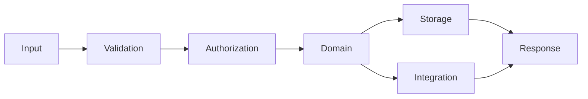

# Data Flow

Data moves through explicit stages: receive, validate, authorize, process, persist or transmit, and respond.

Treat browser input, webhooks, configuration, stored records, and third-party responses as untrusted for their intended use. Minimize sensitive data, never log secrets, and pass identifiers instead of full records when possible.

Failures should identify the stage and correlation context without exposing private data. Retried operations must be idempotent or otherwise protected from duplicate effects.
