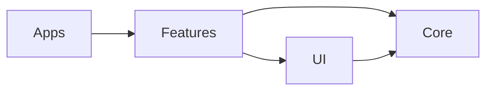

# Architecture

Aerealith is an Nx monorepo with deployable applications under `apps/` and reusable capabilities under `libs/`. Project configuration and public entry points should make ownership and dependency direction visible.

## Package direction

Applications compose libraries. Libraries must not import application implementation details.

## Principles

- Validate data at trust boundaries.
- Keep browser, worker, and build-time code separated.
- Hide persistence and vendor details behind adapters.
- Design observable failures and recoverable operations.
- Use the Nx project graph to verify implemented dependencies.

## Current implementation boundaries

- [Backend & Service Boundaries](/documentation/developer/architecture/backend-service)
- [Authentication & Authorization](/documentation/developer/architecture/auth-and-authorization)
- [Database & Contracts](/documentation/developer/architecture/database-contracts)
- [System Overview](/documentation/developer/architecture/system-overview)
- [Data Flow](/documentation/developer/architecture/data-flow)
